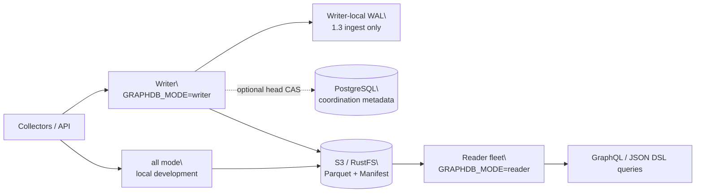

<div align="center">

# GGraphDB

**A general-purpose object-storage-backed graph database for entities, relationships, and topology**

[](https://github.com/SamuelSupe/graphdb/releases)
[](https://github.com/SamuelSupe/graphdb/actions/workflows/release.yml)
[](https://github.com/SamuelSupe/graphdb)

[中文 README](README.zh-CN.md) · [Latest Release](https://github.com/SamuelSupe/graphdb/releases/latest)

</div>

GGraphDB 1.3.1 is a Go-based general-purpose current-state property knowledge graph
for entity-relationship data. Knowledge bases, CMDB, asset relationships,
service dependencies, topology, and impact analysis are supported application
scenarios. It persists tenant data to local disk or S3-compatible object
storage, using Parquet, manifest CAS, snapshots, and commit replay to provide
versioned writes and explicit read-freshness control. It is not an RDF/OWL,
SPARQL, ontology-reasoning, or historical graph engine.

## Highlights

| Capability | Description |
| --- | --- |
| Multi-tenant graph data | Tenant prefixes, entities, edges, and indexes are isolated by `X-Tenant-ID`. |
| Optional domain modeling | Entity types, labels, relation property schemas, identity reconciliation, source priority, and manual merge/split. |
| Graph queries | GraphQL, JSON Query DSL, bounded pattern match, bidirectional traversal, impact, and shortest path. |
| Bulk import | Resumable task-backed JSONL and CSV ingestion. |
| Object-storage persistence | Parquet manifests, commits, snapshots, entity pages, edge shards, and index objects. |
| Read/write topology | One binary supports `all`, `writer`, and `reader` deployment modes. |
| Optional multi-writer coordination | PostgreSQL head CAS supports 2–8 optimistic writers per tenant; the 1.3 WAL profile adds durable ingest takeover while local coordination remains the default. |
| Bounded read-path work | Cold graph loads, query admission, execution budgets, and cache retention are independently bounded. |
| Operations | Compact, GC, backup/restore, repair, integrity audit, index health, and metrics. |

### 1.3 PostgreSQL-CAS multi-writer WAL contract

GGraphDB 1.3.1 ships an opt-in WAL profile for
`POST /v1/ingest/batches`: every writer owns an independent local WAL and
PostgreSQL performs tenant-head CAS plus coordination metadata updates. Object
storage remains the graph-data authority; PostgreSQL never stores ingest
payloads, WAL records, commit segments, or graph data. A `202` means durable
local takeover after WAL `fsync`, not a committed graph version. CAS and
temporary dependency failures remain retryable through rebase and bounded batch
shrinking; a simultaneous PostgreSQL and object-store outage does not produce
an immediate graph commit.

The profile supports 2–8 same-tenant writers in successful CAS order and scales
horizontally across tenants. Every writer needs a stable
`GRAPHDB_INSTANCE_ID`, an independent persistent WAL volume, and an owner-routed
status URL. Batch publish uses a bounded CAS/publish slot and lifecycle
generation fencing: a stale or fenced request cannot publish after a tenant
freeze, delete, or recreate. The complete contract is in the [1.3 design
document](https://github.com/SamuelSupe/graphdb/blob/v1.3.1/docs/ingest-wal-multiwriter-design.md).

The 1.3.1 write path adds commit-equivalent `expected_version`, atomic failure,
and entity/edge precondition semantics to both local and PostgreSQL-coordinated
ingest. Compatible requests sharing a WAL flush baseline are evaluated and
published as bounded CAS cohorts while retaining independent results and WAL
order; payloads are never merged across writers. Recovery compaction is no
longer blocked by stale ingest activity, and direct PostgreSQL ingest now
reserves both idempotency and batch aliases.

The 1.3.1 Go and Python SDKs preserve direct `200/207` results and expose WAL
`202` acceptance, the `Location`/owner status resource, explicit polling/waiting,
and ingest `expected_version`, `failure_mode`, and `preconditions`. GraphQL's
public query contract is limited to the `graph` root; unsupported retrieval
extensions are not product capabilities.

The final 1.3.1 source also removes the dormant retrieval service and storage
side path, consolidates derived-index rebuilds on Parquet, and stops
materializing a duplicate embedded index for every graph snapshot. Snapshots
that contain the legacy `index` field remain readable; authoritative indexes
are rebuilt from graph data.

The release evidence covers full Go tests, focused race and vet checks, plus isolated
PostgreSQL checks for atomic publish/rollback, cross-writer idempotency, 2-, 4-,
and 8-writer same-tenant concurrency, four independent tenants, recovery, and
owner-routed status. These are correctness and recovery results, not an
unbounded throughput or exactly-once guarantee. The durable boundary is process
failure with the original writer WAL volume available; permanent volume loss is
outside the contract.

### Read cache and performance evidence

The measurements in this section were collected as the 1.2.5 fixed-environment
baseline and are carried forward for comparison; they are not new 1.3 capacity
certification.

- Reproducible single-node `GRAPHDB_MODE=all` evidence on OrbStack
  Linux/arm64 (8 CPUs, 8 GiB): 4 writers, 16 readers, 200 items per request,
  and three duration-bound 45-second closed-loop rounds per comparison cohort.
  It compares the identical prebuilt baseline with the warm materialized-reader
  candidate: QPS
  `62.586→106.278` (`+69.81%`), QPS/core `+62.72%`, and mean across
  operation-level p95 `1308.0→386.3 ms` (`-70.46%`).
- When `GRAPHDB_MODE=all` has a warm `ReaderCache` whose cached version
  satisfies the requested freshness target, regular and stream queries use the
  materialized graph. Reader mode and cold-cache requests retain the lazy
  persisted-index path.
- This is bounded fixed-environment evidence, not a production SLO or capacity
  guarantee. Ingest p50 is effectively flat (`14097→13988 ms`, `-0.77%`), while
  ingest p95 is `22291.7→23554.3 ms` (`+5.66%`, candidate CV `8.48%`), so the
  write tail is `UNKNOWN`/not improved; completed counts were `10/9/9` versus
  `10/9/8`. RSS decreased `9.76%` but is `UNKNOWN` because candidate CV was
  `6.56%`.
- Index health was transiently stale in some end samples, and integrity
  snapshots reported `snapshot_catalog_missing` with maintenance disabled;
  neither is a full integrity `PASS`. Snapshot export regressed: mean p95
  `3744.3→5943.0 ms` and completed count `46.3→26.3`. The aggregate p95 has
  sample variability, some hot saved-query and scan paths have p50 regressions,
  and production capacity/full matrix coverage remain `UNKNOWN`.
- The 1.3 capacity envelope supports 2–8 deployed writers, but eight-way
  same-tenant operation is a correctness and availability boundary rather than
  a claim of linear hot-tenant throughput. The historical two-active-writer
  20-commit/s result is a 1.2 baseline; it is not 1.3 WAL capacity
  certification. Re-run the [capacity envelope](docs/capacity.md) in the target
  deployment before setting production limits.

### 1.2.4 query performance update

- Large-bucket field-index lookups use a snapshot-level ordered cache, and a
  stable streaming merge keeps result order deterministic without materializing
  all matches.
- Aggregate and Top-K paths no longer allocate a complete candidate-ID list
  before selecting and merging results.
- OrbStack Go 1.25.14 linux/arm64 process-internal relative evidence
  (baseline→1.2.4): the original benchmark median is
  `7.133→6.058 ms/op` with `304,849→35,800 B/op`; on 50,000-entity range
  aggregate c64 wave, `43.765→31.192 ms`, throughput
  `1,462→2,052 queries/s`, p95 `35.25→14.79 ms`, p99 `53.89→32.18 ms`, and
  `34,614,535→13,642,518 B/wave`.
- These are process-internal relative measurements, not an HTTP,
  object-storage, or mixed read/write production SLO.

### 1.2.3 read/write and query performance update

- Commit-tail replay is concurrent and bounded, while commits are still applied
  by version; compact preserves a newly advanced tail instead of conflicting
  with maintenance.
- Entity-page decode releases Arrow payloads promptly. Heavy graph loads and
  compact operations honor backpressure and timeout bounds.
- Materialized range/aggregate paths copy only final results, use value top-K,
  and deduplicate multi-value index keys. Fuzzy matching avoids per-entity
  filters and string allocations.
- Fixed-environment relative evidence, not a production SLO: tail-31
  `157.146→96.849 ms`, compact `149.525→112.156 ms`, and in-use heap
  `2218.06→1247.61 MB`; native in-process c64 range QPS
  `70.97→777.09` with p95 `1028.15→49.28 ms` and
  `49.763→0.890 MB/query`, and fuzzy QPS `1251.31→2568.26` with p95
  `48.955→12.305 ms` and `1.235 MB→35.187 KB/query`.
- HTTP, stream, saved-query, freshness, and mixed service-level matrices remain
  `UNKNOWN`; these figures do not claim those paths passed.

### 1.2.2 reliability and query update

- Commit-tail compaction and reload reuse already-decoded graph state; persisted
  commit segments load concurrently and are still applied in version order.
- Cold full-graph loads are shared across requests, capped globally at four by
  default, and rejected after a bounded queue wait instead of saturating object
  storage and making unrelated upstream requests time out.
- Query validation now runs before storage I/O, and `timeout_ms` covers
  admission, index access, graph loading, and execution as one end-to-end budget.
- Materialized kind pagination uses stable ID order and stops after `limit + 1`
  matches; unavailable lazy indexes use bounded retry backoff instead of being
  reopened on every request.
- Query and GraphQL request shapes are bounded before storage I/O, and task
  shutdown, index rebuild admission, restore-drill cleanup, coordinator
  rollback, and WAL close paths now preserve explicit terminal errors.

The release was exercised across match, indexed match, neighbors, pattern,
traverse, impact, and shortest-path queries, in addition to the complete Go test
suite. Microbenchmark results are workload and hardware dependent and are not a
production latency SLO.

## Architecture



## Quick start

### Local file storage

Requires Go 1.25 or newer:

```sh
go run ./cmd/graphdb serve
curl -fsS http://127.0.0.1:8080/v1/health
```

### Docker Compose with MinIO

```sh
docker compose up --build
curl -fsS http://127.0.0.1:8080/v1/health
```

### RustFS writer/reader topology

```sh
docker compose -f docker-compose.rustfs.yml up --build
curl -fsS http://127.0.0.1:38080/v1/health  # writer
curl -fsS http://127.0.0.1:38081/v1/health  # reader
```

### Create a tenant, write data, and query

```sh
# 1. Create a tenant
curl -fsS -X POST http://127.0.0.1:8080/v1/tenants \
  -H 'Content-Type: application/json' \
  -d '{"tenant_id":"demo","name":"Demo"}'

# 2. Write example graph data
curl -fsS -X POST http://127.0.0.1:8080/v1/commits \
  -H 'X-Tenant-ID: demo' \
  -H 'Content-Type: application/json' \
  -H 'Idempotency-Key: demo-commit-001' \
  --data @examples/commit.json

# 3. Query with the JSON Query DSL
curl -fsS -X POST http://127.0.0.1:8080/v1/query \
  -H 'X-Tenant-ID: demo' \
  -H 'Content-Type: application/json' \
  --data @examples/query-match.json

# 4. Query the generic graph with GraphQL
curl -fsS -X POST http://127.0.0.1:8080/v1/query/graphql \
  -H 'X-Tenant-ID: demo' \
  -H 'Content-Type: application/json' \
  -d '{"query":"query Find($request: QueryRequest!) { graph(request: $request) { version results stats } }","operationName":"Find","variables":{"request":{"op":"match","kind":"person","where":[{"field":"name","op":"eq","value":"Alice"}],"project":["id","name"],"limit":10}}}'
```

The write response's `version` can be passed as `min_version` to a reader when
the query must observe that write. Use `allow_stale=true` only when eventual
consistency is acceptable.

## Generic graph queries with GraphQL

The `examples/commit.json` dataset contains a non-CMDB graph: `person:alice`
works at `company:acme`. GraphQL accepts the same generic JSON Query DSL request
as a `QueryRequest` variable, so application-defined entity kinds, fields, and
relation types work for organization graphs, project dependencies, data
lineage, and other graph-shaped data.

Find an entity by a property:

```graphql
query FindPerson($request: QueryRequest!) {
  graph(request: $request) {
    version
    results
    stats
  }
}
```

Use `{"op":"match","kind":"person",...}` as the `request` variable. Follow a
typed relationship by changing it to
`{"op":"neighbors","id":"person:alice","relation_types":["works_at"]}`.

See the [GraphQL guide](docs/graphql.md) for the schema, errors, aliases,
fragments, and compatibility boundaries. The old `FIND`/`MATCH` text DSL remains
at `/v1/query/gql` only for 1.0 compatibility and is not GraphQL.

## Deployment modes

| Mode | Use case | Behavior |
| --- | --- | --- |
| `all` | Local development and small single-process deployments | One process handles writes and queries. |
| `writer` | Production write entry point | Write and control APIs; one local writer or a PostgreSQL-coordinated writer fleet. |
| `reader` | Query fleet | Loads from shared object storage and serves queries and exports. |

For production, use shared S3/RustFS storage and multiple readers. Keep the
default `GRAPHDB_COORDINATION=local` topology at one writer per tenant, or use
`GRAPHDB_COORDINATION=postgres` with generic S3/RustFS for 2–8 optimistic
writers. For the 1.3 WAL profile, give every writer a unique stable
`GRAPHDB_INSTANCE_ID`, an independent persistent WAL volume, and route batch
status requests back to that owner. Process readiness actively probes object
storage, and PostgreSQL mode prunes completed coordination rows with bounded
retention. Reader-fleet readiness remains the tenant traffic admission gate.
`X-Tenant-ID` is routing metadata, not authentication. Put authentication,
authorization, TLS, and rate limiting at the gateway or service mesh.

For a rolling downgrade from the 1.3 WAL profile, stop new WAL admission first
and wait until the owner-routed status for that writer shows no pending durable
records. Drain every writer WAL before switching to direct mode, reassigning its
volume, or running an older binary; an unconditional in-place downgrade is not
supported. Preserve the stable writer identity and original WAL volume across a
restart.

## Release

The latest published release is GGraphDB 1.3.1:
[**v1.3.1**](https://github.com/SamuelSupe/graphdb/releases/tag/v1.3.1).
The release hardens the PostgreSQL-CAS multi-writer WAL profile, adds
commit-equivalent conditional and atomic ingest, updates both SDKs, and removes
the unsupported Evidence Search GraphQL and dormant retrieval implementation.
It also removes duplicate snapshot-index work and keeps one Parquet derived-index
path. The fixed-environment read-cache and query measurements below remain
historical evidence, not production SLOs.

Each release archive contains:

- static binaries for Linux amd64, Linux arm64, and macOS arm64;
- Dockerfile, MinIO/RustFS/PostgreSQL Compose files, and examples;
- deployment, security, capacity, API, query, SDK, changelog, and build metadata;
- a `.sha256` checksum file.

See the [release deployment guide](docs/user/release-deployment.md) or its
[中文版本](docs/user/release-deployment.zh-CN.md). Pushing a semantic-version
tag such as `v1.3.1` triggers [GitHub Actions](.github/workflows/release.yml) to
build and publish the archive automatically. Legacy `release_*` tags remain
supported for older deployment workflows.

## Documentation

| Guide | Contents |
| --- | --- |
| [Database introduction](docs/database-introduction.md) · [中文](docs/database-introduction.zh-CN.md) | Product shape, data model, architecture, and boundaries. |
| [Usage manual](docs/user/usage-manual.md) · [中文](docs/user/usage-manual.zh-CN.md) | Tenants, writes, queries, optional CMDB scenario capabilities, indexes, maintenance, and SDKs. |
| [Deployment and operations](docs/user/deploy-ops.md) · [中文](docs/user/deploy-ops.zh-CN.md) | `all`/`writer`/`reader`, S3, RustFS, health checks, and production rules. |
| [Security boundary](docs/security-deployment.md) · [中文](docs/security-deployment.zh-CN.md) | Data/admin listeners, gateway auth, tenant binding, RBAC, and TLS. |
| [Capacity envelope](docs/capacity.md) · [中文](docs/capacity.zh-CN.md) | Release CAS gate, reproducible baselines, and recommended topology. |
| [Release deployment](docs/user/release-deployment.md) · [中文](docs/user/release-deployment.zh-CN.md) | Download, verify, upgrade, rollback, and security boundaries. |
| [Read and query](docs/user/read-query.md) · [中文](docs/user/read-query.zh-CN.md) | GraphQL, JSON DSL, pagination, streaming, explain, and profile. |
| [Write and ingest](docs/user/write-ingest.md) · [中文](docs/user/write-ingest.zh-CN.md) | Commits, ingestion, idempotency, deletes, source policy, and backpressure. |
| [1.3 multi-writer WAL](https://github.com/SamuelSupe/graphdb/blob/v1.3.1/docs/ingest-wal-multiwriter-design.md) · [中文](https://github.com/SamuelSupe/graphdb/blob/v1.3.1/docs/ingest-wal-multiwriter-design.zh-CN.md) | PostgreSQL-CAS ingest contract, owner routing, recovery, and rolling upgrade. |
| [Data model](docs/user/data-model.md) · [中文](docs/user/data-model.zh-CN.md) | Tenants, optional CI types, entities, relations, edges, and source governance. |
| [OpenAPI contract](docs/openapi.yaml) | The complete HTTP API definition. |
| [Go and Python SDKs](docs/user/sdk.md) · [中文](docs/user/sdk.zh-CN.md) | Client setup, reads, writes, streaming, and retry guidance. |
| [All user guides](docs/user/README.md) · [中文](docs/user/README.zh-CN.md) | Complete API, deployment, operations, and troubleshooting map. |

## Project status and boundaries

GGraphDB v1 is intentionally focused:

- a general-purpose entity-relationship graph core, with CMDB governance as an optional domain profile;
- local coordination defaults to one active writer per tenant; optional
  PostgreSQL coordination provides optimistic multi-writer head CAS. The 1.3
  WAL profile adds independent writer-local durability only for ingest batches;
  it does not make direct commits durable during a PostgreSQL outage;
- object storage as the recommended production persistence layer;
- explicit reader freshness controls for strong-read workflows;
- authentication and authorization delegated to the deployment boundary.

See the [feature gap tracker](docs/product_function_gaps.md) for remaining
product work.

## Development

```sh
# Unit and package tests
go test -mod=readonly ./...

# Validate both deployment topologies
docker compose config
docker compose -f docker-compose.rustfs.yml config
```

The repository also contains black-box e2e, load, soak, reader-freshness,
recovery, and release-gate tools under `tools/` and `scripts/`. Read the
relevant operations document before running long or disruptive checks.

## Contributing and license

See [CONTRIBUTING.md](CONTRIBUTING.md), [SECURITY.md](SECURITY.md), and
[LICENSE](LICENSE). The current license is rights-reserved; public source
availability does not grant production or redistribution rights.
