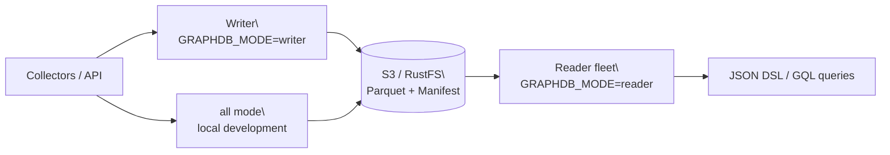

<div align="center">

# GraphDB

**An object-storage-backed graph database for CMDB and IT topology**

[](https://github.com/SamuelSupe/graphdb/releases)
[](https://github.com/SamuelSupe/graphdb/actions/workflows/release.yml)
[](https://github.com/SamuelSupe/graphdb)

[中文 README](README.zh-CN.md) · [Latest Release](https://github.com/SamuelSupe/graphdb/releases/latest)

</div>

GraphDB is a Go-based v1 graph database for CMDB, asset relationships, service
dependencies, and impact analysis. It persists tenant data to local disk or
S3-compatible object storage, using Parquet, manifest CAS, snapshots, and
commit replay to provide versioned writes and explicit read-freshness control.

## Highlights

| Capability | Description |
| --- | --- |
| Multi-tenant graph data | Tenant prefixes, entities, edges, and indexes are isolated by `X-Tenant-ID`. |
| CMDB modeling | CI types, field constraints, identity reconciliation, source priority, and manual merge/split. |
| Graph queries | JSON Query DSL, GQL, match, neighbors, traverse, impact, and shortest path. |
| Object-storage persistence | Parquet manifests, commits, snapshots, entity pages, edge shards, and index objects. |
| Read/write topology | One binary supports `all`, `writer`, and `reader` deployment modes. |
| Operations | Compact, GC, backup/restore, repair, integrity audit, index health, and metrics. |

## Architecture



## Quick start

### Local file storage

Requires Go 1.25 or newer:

```sh
go run ./cmd/graphdb serve
curl -fsS http://127.0.0.1:8080/v1/health
```

### Docker Compose with MinIO

```sh
docker compose up --build
curl -fsS http://127.0.0.1:8080/v1/health
```

### RustFS writer/reader topology

```sh
docker compose -f docker-compose.rustfs.yml up --build
curl -fsS http://127.0.0.1:38080/v1/health  # writer
curl -fsS http://127.0.0.1:38081/v1/health  # reader
```

### Create a tenant, write data, and query

```sh
# 1. Create a tenant
curl -fsS -X POST http://127.0.0.1:8080/v1/tenants \
  -H 'Content-Type: application/json' \
  -d '{"tenant_id":"demo","name":"Demo"}'

# 2. Write example graph data
curl -fsS -X POST http://127.0.0.1:8080/v1/commits \
  -H 'X-Tenant-ID: demo' \
  -H 'Content-Type: application/json' \
  -H 'Idempotency-Key: demo-commit-001' \
  --data @examples/commit.json

# 3. Query with the JSON Query DSL
curl -fsS -X POST http://127.0.0.1:8080/v1/query \
  -H 'X-Tenant-ID: demo' \
  -H 'Content-Type: application/json' \
  --data @examples/query-match.json

# 4. Query with GQL
curl -fsS -X POST http://127.0.0.1:8080/v1/query/gql \
  -H 'X-Tenant-ID: demo' \
  -H 'Content-Type: text/plain' \
  --data-binary 'FIND person WHERE name = "Alice" LIMIT 10'
```

The write response's `version` can be passed as `min_version` to a reader when
the query must observe that write. Use `allow_stale=true` only when eventual
consistency is acceptable.

## Deployment modes

| Mode | Use case | Behavior |
| --- | --- | --- |
| `all` | Local development and small single-process deployments | One process handles writes and queries. |
| `writer` | Production write entry point | Write and control APIs; keep one active writer per tenant. |
| `reader` | Query fleet | Loads from shared object storage and serves queries and exports. |

For production, use shared S3/RustFS storage, one writer per tenant, multiple
readers, and reader-fleet readiness as the traffic admission gate.
`X-Tenant-ID` is routing metadata, not authentication. Put authentication,
authorization, TLS, and rate limiting at the gateway or service mesh.

## Release

The current release is
[**release_20260722_01**](https://github.com/SamuelSupe/graphdb/releases/tag/release_20260722_01).

Each release archive contains:

- static binaries for Linux amd64, Linux arm64, and macOS arm64;
- Dockerfile, MinIO/RustFS Compose files, and examples;
- deployment, usage, API, query, and SDK documentation;
- a `.sha256` checksum file.

See the [release deployment guide](docs/user/release-deployment.md). Pushing a
tag matching `release_*` triggers [GitHub Actions](.github/workflows/release.yml)
to build and publish the archive automatically.

## Documentation

| Guide | Contents |
| --- | --- |
| [Database introduction](docs/database-introduction.md) | Product shape, data model, architecture, and boundaries. |
| [Usage manual](docs/user/usage-manual.md) | Tenants, writes, queries, CMDB, indexes, maintenance, and SDKs. |
| [Deployment and operations](docs/user/deploy-ops.md) | `all`/`writer`/`reader`, S3, RustFS, health checks, and production rules. |
| [Release deployment](docs/user/release-deployment.md) | Download, verify, upgrade, rollback, and security boundaries. |
| [Read and query](docs/user/read-query.md) | JSON DSL, GQL, pagination, streaming, explain, and profile. |
| [Write and ingest](docs/user/write-ingest.md) | Commits, ingestion, idempotency, deletes, source policy, and backpressure. |
| [Data model](docs/user/data-model.md) | Tenants, CI types, entities, relations, edges, and source governance. |
| [OpenAPI contract](docs/openapi.yaml) | The complete HTTP API definition. |
| [Go and Python SDKs](docs/user/sdk.md) | Client setup, reads, writes, streaming, and retry guidance. |

## Project status and boundaries

GraphDB v1 is intentionally focused:

- one active writer per tenant, without a distributed transaction coordinator;
- object storage as the recommended production persistence layer;
- explicit reader freshness controls for strong-read workflows;
- authentication and authorization delegated to the deployment boundary.

See the [feature gap tracker](docs/product_function_gaps.md) for remaining
product work.

## Development

```sh
# Unit and package tests
go test -mod=mod ./...

# Validate both deployment topologies
docker compose config
docker compose -f docker-compose.rustfs.yml config
```

The repository also contains black-box e2e, load, soak, reader-freshness,
recovery, and release-gate tools under `tools/` and `scripts/`. Read the
relevant operations document before running long or disruptive checks.

## Contributing and license

Please open an issue or pull request for bug reports, deployment feedback, and
feature proposals. Keep tenant data, credentials, and generated local state
out of commits.
