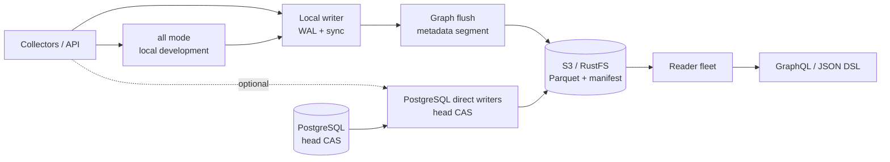

<div align="center">

# GGraphDB

**A general-purpose current-state property graph for entities, relationships, and topology**

[](https://github.com/SamuelSupe/graphdb/actions/workflows/release.yml)
[](https://github.com/SamuelSupe/graphdb/releases/tag/v1.2.3)
[](https://go.dev/)

[中文 README](README.zh-CN.md) · [v1.2.3 release](https://github.com/SamuelSupe/graphdb/releases/tag/v1.2.3) · [Latest releases](https://github.com/SamuelSupe/graphdb/releases)

</div>

GGraphDB v1.2.3 is a Go-based, object-storage-backed property graph for
current-state entity and relationship data. Knowledge bases, asset graphs,
service dependencies, data lineage, topology, impact analysis, and CMDB are
application scenarios—not separate storage engines. The graph model remains
generic: application-defined kinds, fields, relation types, edges, optional
type metadata, and tenant isolation.

For local writers, v1.2.0 introduced the performance-first default path:
one active writer per tenant, a process-wide segmented WAL with `sync`
durability, and metadata segments. A durable ingest response is accepted only
after WAL fsync. Shared object storage is the production persistence boundary;
Parquet segments, manifests, snapshots, and indexes remain recoverable from it.

> **Release status.** `v1.2.3` is the current release identifier. A source
> checkout or tag alone does not prove that the release gates passed. The
> authoritative proof is the [v1.2.3 GitHub Release](https://github.com/SamuelSupe/graphdb/releases/tag/v1.2.3),
> its [successful workflow](https://github.com/SamuelSupe/graphdb/actions/runs/33298859067),
> and packaged commit-bound evidence for `4a87717c`.

> **v1.2.0 base operating contract.** The performance-first local WAL path is the
> default: durable `202 Accepted` only follows WAL fsync, bounded pressure
> returns `429` with `Retry-After`, and release assets are published only with
> commit-bound verification evidence.

## v1.2.3 read/write and query performance update

| Area | Improvement |
| --- | --- |
| Commit tail and graph loading | Commit-tail replay is bounded and concurrent while preserving version order; when the head advances, compact retains the newer tail instead of conflicting with it. |
| Reader memory and freshness | Arrow-backed entity-page strings are released promptly, and successful writes publish a write-through reader-cache update. |
| Query allocations and bounds | Indexed range/aggregate paths use bounded top-K result collection; fuzzy matching avoids per-entity filters and string allocations. |
| Fixed-environment evidence | Relative evidence, not a production SLO: storage tail-31 `-38.37%`, compact `-24.99%`, in-use heap `-43.75%`, and a 120s 8W/8R soak `PASS`; native query c64 range QPS `70.97→777.09` with p95 `1028.15→49.28 ms`, and fuzzy QPS `1251.31→2568.26` with p95 `48.955→12.305 ms`. |
| Service-level boundary | HTTP, stream, saved-query, freshness, and mixed performance matrices remain `UNKNOWN`; the in-process and storage figures above do not claim those paths passed. |

## v1.2.0 base at a glance

| Area | Contract |
| --- | --- |
| Local writer default | `GRAPHDB_INGEST_MODE=wal`, `GRAPHDB_INGEST_METADATA_MODE=segment`, and `GRAPHDB_INGEST_WAL_DURABILITY=sync`; graph flush is 250 ms with a trigger at 8 requests / 2 MiB and 2 workers, while metadata flush is 500 ms with a trigger at 256 requests / 8 MiB and 2 workers. Busy tenants may merge the same-round queue. |
| Durable ingest | `POST /v1/ingest/batches` returns `202 Accepted` after the batch is fsynced to the local WAL, with `Location` and a status resource. |
| Query-visible ingest | Send `Prefer: wait=committed` when the caller needs the final `200/207` result instead of asynchronous durable acceptance. |
| Bounded admission | At queue 80%, WAL 70%, or pending age 2m, admission returns structured `429` with `Retry-After`; at 85% WAL usage readiness becomes drain-only. |
| Write and maintenance safety | The default write cache is 4 GiB, the commit-tail limit is 20,000, heavy background task execution is single-concurrency, and maintenance waits for 1m of tenant ingest idleness. |
| Performance gate | Fixed OrbStack host, 8 CPU/8 GiB, 8 tenants, 16 collectors, five 30-minute baseline runs and five candidate runs; accepted p95/p99 are capped at 20/250 ms, and results are authoritative only in commit-bound evidence packaged with the v1.2.0 Release. |
| Compatibility boundary | The v1.1.5 → v1.2.0 data upgrade is forward-only after segment metadata is activated; PostgreSQL coordination must explicitly use direct ingest. |

## Highlights

| Capability | Description |
| --- | --- |
| Multi-tenant graph data | Tenant prefixes, entities, edges, ingest identities, and indexes are isolated by `X-Tenant-ID`. |
| Generic graph kernel | Schemaless entities, typed/directed edges, application-defined kinds and relation types, JSON fields, pagination, streaming, aggregation, bounded traversal, and impact queries. |
| Optional domain modeling | CI/entity types, inheritance, field constraints, identity keys, relation schemas, source priority, and merge/split governance for profiles such as CMDB. |
| Query APIs | GraphQL, JSON Query DSL, and the custom GQL text endpoint; query planning exposes bounded/admission controls rather than unbounded scans. |
| Ingestion and import | Idempotent direct commits, durable WAL batches, resumable JSONL/CSV import, collector status, and structured retry errors. |
| Object-storage persistence | Parquet commit and metadata segments, manifests, snapshots, entity pages, edge shards, and rebuildable indexes on local or S3-compatible storage. |
| Operations | Health/readiness, compact, GC, backup/restore, repair, integrity audit, index health, metrics, and reader-freshness controls. |

## Architecture



The default local topology keeps one active writer per tenant and uses the
local WAL as the durable acceptance boundary. Readers load the shared object
store independently. PostgreSQL coordination is an optional optimistic
multi-writer head-CAS path; it does not provide a distributed WAL, so a
PostgreSQL writer must set `GRAPHDB_INGEST_MODE=direct` explicitly.

## Quick start

### Local file storage

Requires Go 1.25 or newer. The explicit environment below shows the v1.2.0
local-writer defaults; keep `GRAPHDB_DATA_DIR` on persistent storage in a
container deployment.

```sh
GRAPHDB_MODE=all \
GRAPHDB_STORAGE=local \
GRAPHDB_DATA_DIR=.graphdb \
GRAPHDB_INGEST_MODE=wal \
GRAPHDB_INGEST_METADATA_MODE=segment \
GRAPHDB_INGEST_WAL_DURABILITY=sync \
go run ./cmd/graphdb serve

curl -fsS http://127.0.0.1:8080/v1/health
```

### Docker Compose with MinIO

The supplied profile persists the writer data directory in a named volume:

```sh
docker compose up --build
curl -fsS http://127.0.0.1:8080/v1/health
```

### RustFS writer/reader topology

```sh
docker compose -f docker-compose.rustfs.yml up --build
curl -fsS http://127.0.0.1:38080/v1/health  # writer
curl -fsS http://127.0.0.1:38081/v1/health  # reader
```

### Create a tenant, write data, and query

```sh
# 1. Create a tenant
curl -fsS -X POST http://127.0.0.1:8080/v1/tenants \
  -H 'Content-Type: application/json' \
  -d '{"tenant_id":"demo","name":"Demo"}'

# 2. Write example graph data
curl -fsS -X POST http://127.0.0.1:8080/v1/commits \
  -H 'X-Tenant-ID: demo' \
  -H 'Content-Type: application/json' \
  -H 'Idempotency-Key: demo-commit-001' \
  --data @examples/commit.json

# 3. Query with the JSON Query DSL
curl -fsS -X POST http://127.0.0.1:8080/v1/query \
  -H 'X-Tenant-ID: demo' \
  -H 'Content-Type: application/json' \
  --data @examples/query-match.json

# 4. Query the generic graph with GraphQL
curl -fsS -X POST http://127.0.0.1:8080/v1/query/graphql \
  -H 'X-Tenant-ID: demo' \
  -H 'Content-Type: application/json' \
  -d '{"query":"query Find($request: QueryRequest!) { graph(request: $request) { version results stats } }","operationName":"Find","variables":{"request":{"op":"match","kind":"person","where":[{"field":"name","op":"eq","value":"Alice"}],"project":["id","name"],"limit":10}}}'
```

The write response's `version` can be passed as `min_version` to a reader when
the query must observe that write. Use `allow_stale=true` only when eventual
consistency is acceptable.

## Durable ingest and bounded backpressure

The default batch endpoint acknowledges a durable WAL append before the graph
flush completes:

```sh
curl -i -X POST http://127.0.0.1:8080/v1/ingest/batches \
  -H 'X-Tenant-ID: demo' \
  -H 'Content-Type: application/json' \
  -H 'Idempotency-Key: demo-batch-001' \
  -d '{"source":"agent","collector_id":"collector-a","batch_id":"demo-batch-001","idempotency_key":"demo-batch-001","items":[]}'
```

In local WAL mode this returns durable `202 Accepted` after fsync, with a
status URL. Poll that URL with the same tenant header, or request the final
query-visible result directly:

```sh
curl -i -X POST http://127.0.0.1:8080/v1/ingest/batches \
  -H 'X-Tenant-ID: demo' \
  -H 'Content-Type: application/json' \
  -H 'Prefer: wait=committed' \
  -H 'Idempotency-Key: demo-batch-002' \
  -d '{"source":"agent","collector_id":"collector-a","batch_id":"demo-batch-002","idempotency_key":"demo-batch-002","items":[]}'
```

`Prefer: wait=committed` waits for the durable metadata segment and returns
the final `200` or `207` result. When admission is bounded, the writer returns
`429` with `Retry-After`, `retry_after_ms`, and structured `reasons` for queue,
WAL, or oldest-pending-age pressure. Retry the same `batch_id` and
`idempotency_key` with backoff; do not create a new identity for the same
source page.

## Generic graph queries with GraphQL

The `examples/commit.json` dataset contains a non-CMDB graph: `person:alice`
works at `company:acme`. GraphQL accepts the same generic JSON Query DSL request
as a `QueryRequest` variable, so application-defined entity kinds, fields, and
relation types work for organization graphs, project dependencies, data
lineage, and other graph-shaped data.

Find an entity by a property:

```graphql
query FindPerson($request: QueryRequest!) {
  graph(request: $request) {
    version
    results
    stats
  }
}
```

Use `{"op":"match","kind":"person",...}` as the `request` variable. Follow a
typed relationship by changing it to
`{"op":"neighbors","id":"person:alice","relation_types":["works_at"]}`.

See the [GraphQL guide](docs/graphql.md), [custom GQL guide](docs/gql.md), and
[query capability map](docs/query_capabilities.md). `/v1/query/graphql` is
GraphQL; `/v1/query/gql` is GGraphDB's custom `FIND`/`MATCH` text endpoint, not
SPARQL.

## Positioning and boundaries

GGraphDB is a general current-state **property graph**. CMDB governance is an
optional application profile, not the kernel's product limit. The v1.2.0
contract does not claim RDF-native storage, lossless RDF round-tripping,
SPARQL, OWL inference, named graphs, blank nodes, RDF multi-`rdf:type`,
typed/language literals, historical graph queries, Cypher/Gremlin compatibility,
subqueries, joins, UDFs, or expression computation. Use the property-graph
model and the documented GraphQL/JSON/GQL APIs when those boundaries matter.

## Deployment modes

| Mode | Use case | Behavior |
| --- | --- | --- |
| `all` | Local development and small single-process deployments | One process handles writes and queries; local coordination uses the WAL defaults. |
| `writer` | Production write entry point | Write and control APIs; one local writer per tenant, or explicit PostgreSQL-coordinated direct writers. |
| `reader` | Query fleet | Loads from shared object storage and serves queries and exports; it does not accept writes. |

For production, use shared S3/RustFS storage and multiple readers. Keep the
default `GRAPHDB_COORDINATION=local` topology at one writer per tenant. For
PostgreSQL coordination, set `GRAPHDB_INGEST_MODE=direct`; two to eight
optimistic writers are a separate correctness and CAS gate, not the local WAL
path. `X-Tenant-ID` is routing metadata, not authentication. Put
authentication, authorization, TLS, and rate limiting at the gateway or
service mesh.

## Release

The current release is [GGraphDB v1.2.3](https://github.com/SamuelSupe/graphdb/releases/tag/v1.2.3), with [latest releases](https://github.com/SamuelSupe/graphdb/releases) kept as the public release index.
All CI release gates passed, including unit/vet/race, Python SDK, v1
compatibility, and RustFS/CAS/load/restore integration. The 30-minute
PostgreSQL CAS soak and rollback also passed; the packaged evidence is bound
to commit `4a87717c`. See the [workflow run](https://github.com/SamuelSupe/graphdb/actions/runs/33298859067)
and [v1.2.3 Release](https://github.com/SamuelSupe/graphdb/releases/tag/v1.2.3).

The workflow on `main` retains the fixed-host local WAL performance gate for
future tags. Before packaging it verifies
`artifacts/wal-performance/gate.json` with five baseline and five candidate
runs, threshold results, and commit binding. A failed performance gate means
no archive is produced. This is the v1.2.0 acceptance contract described below;
it must not be presented as additional v1.2.3 evidence.

The performance contract is intentionally explicit rather than a benchmark
claim: an 8 CPU/8 GiB OrbStack host runs eight tenants and 16 collectors for
five 30-minute v1.1.5 baseline runs and five v1.2.0 candidate runs. Candidate
thresholds include at least 10,000 committed mutations/s, a median throughput
ratio of at least 1.5, no more than 5% run spread, accepted p95/p99 at most
20/250 ms, committed p95/p99 at most 8/15 seconds, RSS at most 7 GiB and 110%
of baseline, CPU per 1,000 mutations at most 75% of baseline, and direct-write
and query regressions at most 10%. Treat these as release thresholds; measured
results are authoritative only when the v1.2.0 GitHub Release packages the
corresponding commit-bound matrix evidence.

See the [capacity envelope](docs/capacity.md),
[release checklist](docs/release-checklist.md), and
[release deployment guide](docs/user/release-deployment.md). Each release
archive contains static binaries for Linux amd64, Linux arm64, and macOS arm64,
checksums, Compose profiles, examples, SDKs, OpenAPI, and the release evidence
accepted by the workflow. Legacy `release_*` tags remain supported for older
deployment workflows.

## Documentation

| Guide | Contents |
| --- | --- |
| [Database introduction](docs/database-introduction.md) · [中文](docs/database-introduction.zh-CN.md) | Product shape, data model, architecture, and boundaries. |
| [Usage manual](docs/user/usage-manual.md) · [中文](docs/user/usage-manual.zh-CN.md) | Tenants, writes, queries, optional CMDB scenario capabilities, indexes, maintenance, and SDKs. |
| [Deployment and operations](docs/user/deploy-ops.md) · [中文](docs/user/deploy-ops.zh-CN.md) | `all`/`writer`/`reader`, S3, RustFS, health checks, and production rules. |
| [Security boundary](docs/security-deployment.md) · [中文](docs/security-deployment.zh-CN.md) | Data/admin listeners, gateway auth, tenant binding, RBAC, and TLS. |
| [Capacity envelope](docs/capacity.md) · [中文](docs/capacity.zh-CN.md) | Fixed-host release thresholds, reproducible baselines, and recommended topology. |
| [Release deployment](docs/user/release-deployment.md) · [中文](docs/user/release-deployment.zh-CN.md) | Download, verify, upgrade, rollback, and security boundaries. |
| [Read and query](docs/user/read-query.md) · [中文](docs/user/read-query.zh-CN.md) | GraphQL, JSON DSL, pagination, streaming, explain, and profile. |
| [Write and ingest](docs/user/write-ingest.md) · [中文](docs/user/write-ingest.zh-CN.md) | Direct commits, WAL/segment ingest, durable `202`, `Prefer`, idempotency, and backpressure. |
| [Data model](docs/user/data-model.md) · [中文](docs/user/data-model.zh-CN.md) | Tenants, optional CI types, entities, relations, edges, and source governance. |
| [API map](docs/user/api-map.md) · [中文](docs/user/api-map.zh-CN.md) | HTTP endpoints grouped by domain. |
| [OpenAPI contract](docs/openapi.yaml) | The complete HTTP API definition. |
| [Go and Python SDKs](docs/user/sdk.md) · [中文](docs/user/sdk.zh-CN.md) | Client setup, reads, writes, streaming, durable ingest, and retry guidance. |
| [All user guides](docs/user/README.md) · [中文](docs/user/README.zh-CN.md) | Complete API, deployment, operations, and troubleshooting map. |

## Development

```sh
# Unit, vet, and race checks
go test -mod=readonly ./...
go vet -mod=readonly ./...
go test -mod=readonly -race ./...

# Validate deployment topology syntax
docker compose config
docker compose -f docker-compose.rustfs.yml config
```

The formal release-only matrix is intentionally long-running and requires a
clean, commit-bound worktree plus a fixed OrbStack host:

```sh
scripts/wal_performance_matrix.sh
```

The repository also contains black-box e2e, load, soak, recovery, and release
gate tools under `tools/` and `scripts/`. Read the relevant operations document
before running long or disruptive checks.

## Contributing and license

See [CONTRIBUTING.md](CONTRIBUTING.md), [SECURITY.md](SECURITY.md), and
[LICENSE](LICENSE). The current license is rights-reserved; public source
availability does not grant production or redistribution rights.
