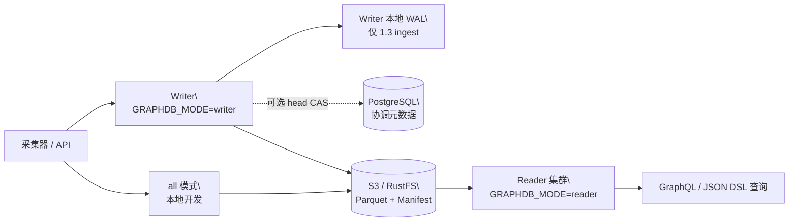

<div align="center">

# GGraphDB

**面向实体、关系与拓扑的通用对象存储图数据库**

[](https://github.com/SamuelSupe/graphdb/releases)
[](https://github.com/SamuelSupe/graphdb/actions/workflows/release.yml)
[](https://github.com/SamuelSupe/graphdb)

[English README](README.md) · [最新发行版](https://github.com/SamuelSupe/graphdb/releases/latest)

</div>

GGraphDB 1.2.4 是一个 Go 实现的通用当前态属性知识图谱，面向实体关系数据。
知识库、CMDB、资产关系、服务依赖、IT 拓扑和影响分析都是它支持的应用场景。
它把租户数据持久化到本地磁盘或 S3 兼容对象存储，使用 Parquet、manifest
CAS、快照和提交回放，提供可追踪的写入版本与可控的新鲜度。它不是 RDF/OWL、
SPARQL、本体推理或历史图引擎。

## 核心能力

| 能力 | 说明 |
| --- | --- |
| 多租户图数据 | 通过 `X-Tenant-ID` 隔离租户前缀、实体、边和索引。 |
| 可选领域建模 | 实体类型、标签、关系属性 schema、identity reconciliation、source priority 和人工合并/拆分。 |
| 图查询 | GraphQL、JSON Query DSL、有界 pattern match、双向遍历、impact、shortest path。 |
| 批量导入 | task 驱动、可恢复的 JSONL 和 CSV ingest。 |
| 对象存储持久化 | Parquet manifest、commit、snapshot、entity page、edge shard 和 index object。 |
| 读写分离 | 同一二进制支持 `all`、`writer`、`reader`，通过部署拓扑分流。 |
| 可选多写协调 | PostgreSQL head CAS 支持每租户 2–8 个乐观并发 writer，本地协调仍为默认。 |
| 有界读路径 | 冷图加载、查询准入、执行预算和缓存驻留分别设有独立边界。 |
| 运维能力 | compact、GC、backup/restore、repair、integrity audit、index health 和 metrics。 |

### 1.3 PostgreSQL-CAS 多 writer WAL 合同

1.3 实现工作流定义了一个可选的 `/v1/ingest/batches` WAL profile：每个
writer 拥有独立本地 WAL，PostgreSQL 负责 tenant-head CAS 和协调元数据更新。
对象存储仍是图数据权威；PostgreSQL 不保存 ingest payload、WAL record、commit
segment 或图数据。`202` 表示本地 WAL `fsync` 后已持久接管，不是图版本已经提交。
CAS 和依赖的暂时故障通过重基与缩批重试。

该 profile 支持按 CAS 顺序进行同租户 2–8 writer 并发，扩展目标是跨租户。每个
writer 必须使用稳定的 `GRAPHDB_INSTANCE_ID` 和 owner-routed 状态 URL。该合同
仍受发行门禁约束；本文不宣称当前分支已经通过验收矩阵，详见
[1.3 设计文档](docs/ingest-wal-multiwriter-design.zh-CN.md)。

### 1.2.4 查询性能更新

- 大 bucket 字段索引查询使用快照级有序缓存；稳定的流式归并保持结果顺序确定，
  不需要先物化全部匹配项。
- 聚合和 Top-K 路径不再为候选结果分配完整的候选 ID 列表，再进行选择和归并。
- OrbStack Go 1.25.14 linux/arm64 进程内相对证据（基线→1.2.4）：原 benchmark
  中位数 `7.133→6.058 ms/op`、分配 `304,849→35,800 B/op`；5 万实体
  range aggregate c64 wave 为 `43.765→31.192 ms`，吞吐
  `1,462→2,052 queries/s`，p95 `35.25→14.79 ms`，p99 `53.89→32.18 ms`，
  `34,614,535→13,642,518 B/wave`。
- 以上是进程内相对测量，不是 HTTP、对象存储或混合读写生产 SLO。

### 1.2.3 读写与查询性能更新

- commit tail replay 支持有界并发，并继续按版本顺序应用；head 前进时 compact
  保留新 tail，避免与维护过程冲突。
- entity page 解码后及时释放 Arrow payload；重型 graph load 和 compact 受背压与
  timeout 边界约束。
- 物化 range/aggregate 路径只复制最终结果，支持 value top-K，多值索引按键去重；
  fuzzy 避免逐实体过滤器和字符串分配。
- 固定环境相对证据（不是生产 SLO）：tail-31 `157.146→96.849 ms`、compact
  `149.525→112.156 ms`、in-use heap `2218.06→1247.61 MB`；native in-process
  c64 range QPS `70.97→777.09`、p95 `1028.15→49.28 ms`、
  `49.763→0.890 MB/query`；fuzzy QPS `1251.31→2568.26`、p95
  `48.955→12.305 ms`、`1.235 MB→35.187 KB/query`。
- HTTP、stream、saved query、freshness 和混合 service-level 矩阵仍为
  `UNKNOWN`；以上数字不代表这些路径已通过。

### 1.2.2 可靠性与查询更新

- commit tail compact 与重新加载会复用已解码的图状态；持久化 commit segment
  并发加载，并继续严格按版本顺序应用。
- 完整图冷加载会在请求间共享，默认全局并发上限为 4；等待槽位超过有界时间
  后直接拒绝，避免对象存储过载并拖慢无关的上游请求。
- 查询校验提前到存储 I/O 之前，`timeout_ms` 统一覆盖准入、索引访问、图加载
  和执行阶段。
- 物化 kind 分页使用稳定 ID 顺序，取得 `limit + 1` 条匹配后立即停止；不可用
  的惰性索引使用有界退避，避免每次请求重复打开失败索引。
- 查询与 GraphQL 请求会在存储 I/O 前执行有界校验；任务退出、索引重建准入、
  恢复演练清理、协调器回滚和 WAL 关闭路径现在都会保留明确的终态错误。

本版本除完整 Go 测试套件外，还覆盖了 match、索引 match、neighbors、pattern、
traverse、impact 和 shortest path 查询。微基准结果会随数据与硬件变化，不作为
生产延迟 SLO。

## 架构一览



## 快速开始

### 本地文件存储

需要 Go 1.25 或更高版本：

```sh
go run ./cmd/graphdb serve
curl -fsS http://127.0.0.1:8080/v1/health
```

### Docker Compose + MinIO

```sh
docker compose up --build
curl -fsS http://127.0.0.1:8080/v1/health
```

### RustFS Writer/Reader 拓扑

```sh
docker compose -f docker-compose.rustfs.yml up --build
curl -fsS http://127.0.0.1:38080/v1/health  # writer
curl -fsS http://127.0.0.1:38081/v1/health  # reader
```

### 创建租户、写入数据并查询

```sh
# 1. 创建租户
curl -fsS -X POST http://127.0.0.1:8080/v1/tenants \
  -H 'Content-Type: application/json' \
  -d '{"tenant_id":"demo","name":"Demo"}'

# 2. 写入示例图数据
curl -fsS -X POST http://127.0.0.1:8080/v1/commits \
  -H 'X-Tenant-ID: demo' \
  -H 'Content-Type: application/json' \
  -H 'Idempotency-Key: demo-commit-001' \
  --data @examples/commit.json

# 3. 使用 JSON Query DSL 查询
curl -fsS -X POST http://127.0.0.1:8080/v1/query \
  -H 'X-Tenant-ID: demo' \
  -H 'Content-Type: application/json' \
  --data @examples/query-match.json

# 4. 使用 GraphQL 查询通用图数据
curl -fsS -X POST http://127.0.0.1:8080/v1/query/graphql \
  -H 'X-Tenant-ID: demo' \
  -H 'Content-Type: application/json' \
  -d '{"query":"query Find($request: QueryRequest!) { graph(request: $request) { version results stats } }","operationName":"Find","variables":{"request":{"op":"match","kind":"person","where":[{"field":"name","op":"eq","value":"Alice"}],"project":["id","name"],"limit":10}}}'
```

写入响应中的 `version` 可以作为 reader 查询的 `min_version`，保证读到指定
版本；只有在明确接受最终一致性时才使用 `allow_stale=true`。

## 通用图场景：使用 GraphQL 查询

`examples/commit.json` 包含一个非 CMDB 的通用图：`person:alice` 通过
`works_at` 关系连接到 `company:acme`。GraphQL 通过 `QueryRequest` 变量接收
通用 JSON Query DSL，因此应用自定义的实体类型、字段和关系类型同样适用于
组织关系、项目依赖、数据血缘和其他图结构数据。

GraphQL document：

```graphql
query FindPerson($request: QueryRequest!) {
  graph(request: $request) {
    version
    results
    stats
  }
}
```

变量使用 `{"op":"match","kind":"person",...}`；要沿关系查询一跳邻居，可改为
`{"op":"neighbors","id":"person:alice","relation_types":["works_at"]}`。

schema、错误、alias、fragment 和 1.1 边界见
[GraphQL 文档](docs/graphql.zh-CN.md)。旧 `FIND`/`MATCH` 文本 DSL 仅在
`/v1/query/gql` 保留 1.0 兼容，不是 GraphQL。

## 部署模式

| 模式 | 适用场景 | 行为 |
| --- | --- | --- |
| `all` | 本地开发、小规模单进程部署 | 同一进程处理写入和查询。 |
| `writer` | 生产写入入口 | 写入和控制 API；本地单 writer 或 PostgreSQL 协调的 writer 集群。 |
| `reader` | 查询集群 | 从共享对象存储加载数据，提供查询和导出。 |

生产部署建议使用共享 S3/RustFS 和多个 reader。默认
`GRAPHDB_COORDINATION=local` 时每租户保持一个 writer；需要 2–8 个乐观并发
writer 时，对 generic S3/RustFS 使用 `GRAPHDB_COORDINATION=postgres`。1.3 WAL
profile 下，每个 writer 还必须有唯一稳定的 `GRAPHDB_INSTANCE_ID`、独立持久
WAL 卷，并把 batch status 请求路由回 owner。进程 readiness 主动探测对象存储，
PostgreSQL 模式按保留窗口清理已完成的协调记录；租户流量仍以 reader fleet
readiness 作为接入条件。
`X-Tenant-ID` 是租户路由标识，不是认证机制；认证、授权、TLS 和限流应由
网关或服务网格提供。

## 发行版

最新已发布版本为 GGraphDB 1.2.4：
[**v1.2.4**](https://github.com/SamuelSupe/graphdb/releases/tag/v1.2.4)。
发布工作流只有在该 tag 的发行 checklist、30 分钟 PostgreSQL CAS 门禁和
正式回滚演练全部通过后才会发布。

发行包包含：

- Linux amd64、Linux arm64、macOS arm64 静态二进制；
- Dockerfile、MinIO/RustFS/PostgreSQL Compose 文件和 examples；
- 部署、安全、容量、API、查询、SDK、changelog 和构建元数据；
- `.sha256` 校验文件。

详见[发行版部署文档](docs/user/release-deployment.zh-CN.md)，也可查看
[英文版本](docs/user/release-deployment.md)。推送类似 `v1.2.4` 的语义化版本
标签会触发 [GitHub Actions](.github/workflows/release.yml)，自动构建并发布
归档包。为兼容旧部署流程，`release_*` 标签仍然受支持。

## 文档入口

| 文档 | 内容 |
| --- | --- |
| [数据库简介](docs/database-introduction.zh-CN.md) · [English](docs/database-introduction.md) | 产品定位、数据模型、架构和当前边界。 |
| [使用手册](docs/user/usage-manual.zh-CN.md) · [English](docs/user/usage-manual.md) | 租户、写入、查询、可选的 CMDB 场景能力、索引、维护和 SDK。 |
| [部署与运维](docs/user/deploy-ops.zh-CN.md) · [English](docs/user/deploy-ops.md) | `all`/`writer`/`reader`、S3、RustFS、健康检查和生产规则。 |
| [安全边界](docs/security-deployment.zh-CN.md) · [English](docs/security-deployment.md) | 数据/管理 listener、网关认证、租户绑定、RBAC 与 TLS。 |
| [容量边界](docs/capacity.zh-CN.md) · [English](docs/capacity.md) | 发行 CAS 门禁、可复现基线和推荐拓扑。 |
| [发行版部署](docs/user/release-deployment.zh-CN.md) · [English](docs/user/release-deployment.md) | Release 下载、校验、升级、回滚和安全边界。 |
| [读与查询](docs/user/read-query.zh-CN.md) · [English](docs/user/read-query.md) | GraphQL、JSON DSL、分页、流式、explain 和 profile。 |
| [写入与采集](docs/user/write-ingest.zh-CN.md) · [English](docs/user/write-ingest.md) | commit、ingest、幂等、删除、source policy 和背压。 |
| [1.3 多 writer WAL](docs/ingest-wal-multiwriter-design.zh-CN.md) · [English](docs/ingest-wal-multiwriter-design.md) | PostgreSQL-CAS ingest 合同、owner 路由、恢复和滚动升级。 |
| [数据模型](docs/user/data-model.zh-CN.md) · [English](docs/user/data-model.md) | tenant、可选 CI type、entity、relation、edge 和数据治理。 |
| [API Map](docs/user/api-map.zh-CN.md) · [English](docs/user/api-map.md) | 按领域整理的 HTTP endpoint 清单。 |
| [OpenAPI](docs/openapi.yaml) | HTTP API 合同，也可通过 `GET /openapi.yaml` 获取。 |
| [Go/Python SDK](docs/user/sdk.zh-CN.md) · [English](docs/user/sdk.md) | SDK 初始化、读写、流式访问和重试指导。 |
| [全部用户指南](docs/user/README.zh-CN.md) · [English](docs/user/README.md) | 完整 API、部署、运维和故障排查入口。 |

## 当前边界

GGraphDB v1 目前明确保持以下边界：

- 通用实体关系图内核，CMDB 数据治理作为可选的领域 profile；
- 本地协调默认每租户一个活跃 writer；可选 PostgreSQL 协调提供乐观多 writer
  head CAS；1.3 WAL profile 仅为 ingest batch 增加独立 writer 本地持久接管；
- 对象存储是生产持久化的推荐来源；
- 强读场景通过显式 reader freshness 控制；
- 认证和授权由部署边界负责。

详细限制和成熟度缺口见[功能缺口跟踪](docs/product_function_gaps.md)。

## 开发

```sh
# 单元测试和包测试
go test -mod=readonly ./...

# 校验两种部署拓扑
docker compose config
docker compose -f docker-compose.rustfs.yml config
```

仓库还包含位于 `tools/` 和 `scripts/` 下的黑盒 e2e、负载、soak、
reader freshness、恢复和发行版门禁工具。运行长时间或有影响的检查前，
请先阅读对应的运维文档。

## 贡献与许可证

详见 [CONTRIBUTING.md](CONTRIBUTING.md)、[SECURITY.md](SECURITY.md) 和
[LICENSE](LICENSE)。当前许可证为 rights-reserved；源码公开不代表授予
生产使用或再分发权利。
