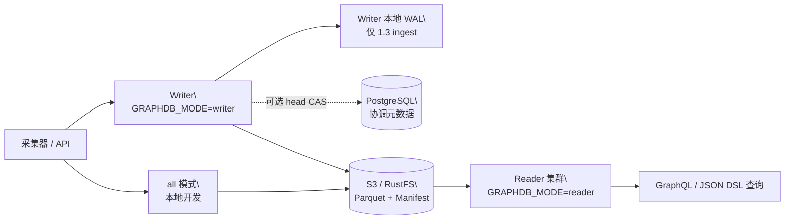

<div align="center">

# GGraphDB

**面向实体、关系与拓扑的通用对象存储图数据库**

[](https://github.com/SamuelSupe/graphdb/releases)
[](https://github.com/SamuelSupe/graphdb/actions/workflows/release.yml)
[](https://github.com/SamuelSupe/graphdb)

[English README](README.md) · [GGraphDB 1.3.2 发行版](https://github.com/SamuelSupe/graphdb/releases/tag/v1.3.2)

</div>

GGraphDB 1.3.2 是一个 Go 实现的通用当前态属性知识图谱，面向实体关系数据。
知识库、CMDB、资产关系、服务依赖、IT 拓扑和影响分析都是它支持的应用场景。
它把租户数据持久化到本地磁盘或 S3 兼容对象存储，使用 Parquet、manifest
CAS、快照和提交回放，提供可追踪的写入版本与可控的新鲜度。它不是 RDF/OWL、
SPARQL、本体推理或历史图引擎。

## 核心能力

| 能力 | 说明 |
| --- | --- |
| 多租户图数据 | 通过 `X-Tenant-ID` 隔离租户前缀、实体、边和索引。 |
| 可选领域建模 | 实体类型、标签、关系属性 schema、identity reconciliation、source priority 和人工合并/拆分。 |
| 图查询 | GraphQL、JSON Query DSL、有界 pattern match、双向遍历、impact、shortest path。 |
| 批量导入 | task 驱动、可恢复的 JSONL 和 CSV ingest。 |
| 对象存储持久化 | Parquet manifest、commit、snapshot、entity page、edge shard 和 index object。 |
| 读写分离 | 同一二进制支持 `all`、`writer`、`reader`，通过部署拓扑分流。 |
| 可选多写协调 | PostgreSQL head CAS 支持每租户 2–8 个乐观并发 writer；1.3 WAL profile 为 ingest 增加持久接管，本地协调仍为默认。 |
| 有界读路径 | 冷图加载、查询准入、执行预算和缓存驻留分别设有独立边界。 |
| 运维能力 | compact、GC、backup/restore、repair、integrity audit、index health 和 metrics。 |

### 1.3 PostgreSQL-CAS 多 writer WAL 合同

GGraphDB 1.3.2 保留可选的 `/v1/ingest/batches` WAL profile：每个
writer 拥有独立本地 WAL，PostgreSQL 负责 tenant-head CAS 和协调元数据更新。
对象存储仍是图数据权威；PostgreSQL 不保存 ingest payload、WAL record、commit
segment 或图数据。`202` 表示本地 WAL `fsync` 后已持久接管，不是图版本已经提交。
CAS 和依赖的暂时故障仍通过重基与有界缩批重试；PostgreSQL 与对象存储同时故障
时不会立即提交图版本。

该 profile 支持按成功 CAS 顺序进行同租户 2–8 writer 并发，并支持跨租户横向
扩展。每个 writer 必须使用稳定的 `GRAPHDB_INSTANCE_ID`、独立持久 WAL 卷和
owner-routed 状态 URL。批量发布使用有界 CAS/publish slot 和生命周期
generation fence：租户 freeze、delete 或 recreate 后，旧 generation 的请求
不能发布。完整合同见[1.3 设计文档](https://github.com/SamuelSupe/graphdb/blob/v1.3.2/docs/ingest-wal-multiwriter-design.zh-CN.md)。

1.3.1 在本地与 PostgreSQL 协调的 ingest 中补齐与 commit 对等的
`expected_version`、atomic failure 和实体/边 precondition 语义。共享同一 WAL
flush baseline 的兼容请求会组成有界 CAS cohort 统一计算和发布，同时保留独立结果
与 WAL 顺序；不同 writer 之间不会合并 payload。恢复性 compact 不再被陈旧的
ingest activity 阻塞，PostgreSQL direct ingest 也会同时预留幂等键与 batch alias。

1.3.1 Go/Python SDK 保留 direct 模式的 `200/207` 结果，并提供 WAL 的 durable
`202` acceptance、`Location`/owner status 资源、显式轮询/等待，以及 ingest
的 `expected_version`、`failure_mode` 和 `preconditions`。GraphQL 公开合同只
保留 `graph` 查询根；未接通的检索增强扩展不属于当前产品能力。

最终的 1.3.1 源码同时删除未接通的 retrieval service 和存储旁路，将派生索引
重建收敛到 Parquet 单一路径，并停止为每个图快照重复构造内嵌索引。包含旧
`index` 字段的快照仍可读取；权威索引继续从图数据重建。

### 1.3.2 ingest 可靠性修复

1.3.2 保持 1.3 WAL record 格式、HTTP 合同和图/对象布局不变，修复了持久准入
与完成路径的边界问题：

- 并发 `Accept` 按 WAL append 顺序入队；
- WAL pruning 会保留已接收记录，直到对应 active state 完成登记；
- terminal preparation 失败时重试整个完成批次；逐条 terminal WAL 错误仍保留成功前缀的重试边界；
- direct ingest 已发布数据后，如果 metadata/object-store 返回 wrapped
  `context.DeadlineExceeded` 但整体 `writeCtx` 仍有效，现在沿用 timeout 分支，返回
  `504 request_timeout`、`retryable: true` 并失效缓存；已发布数据仍可见；
- 同租户 shutdown 不再忙循环，多租户同时活跃时 ready/complete 队列不会死锁。

本源码树的本地 Go 测试、`go vet`、聚焦 race 检查和隔离 PostgreSQL 检查已通过。
发布归档只有在静态检查、RustFS/PostgreSQL 集成、30 分钟 CAS soak 和 rollback
检查通过后才会构建；本地证据不表示这些发布门禁已经通过。实际运行和发布状态见
[release workflow](.github/workflows/release.yml) 与
[GitHub releases](https://github.com/SamuelSupe/graphdb/releases)。

1.3.1 发行证据覆盖完整 Go 测试、聚焦 race 和 vet，以及隔离 PostgreSQL 下的原子发布/回滚、
跨 writer 幂等、同租户 2、4、8 writer 并发、四个独立租户、恢复和 owner 路由状态。
这些是正确性与恢复结果，不是无界吞吐或 exactly-once 保证。持久性边界是进程
故障且原 writer WAL 卷仍可恢复；WAL 卷永久丢失不在合同内。

### 读缓存与性能证据

本节测量来自 1.2.5 的固定环境基线，并在此作为对比参考；它们不是新的 1.3
容量认证。

- 可复现的单节点 `GRAPHDB_MODE=all` 证据运行于 OrbStack Linux/arm64（8 CPU、
  8 GiB）：4 个 writer、16 个 reader、每个请求 200 条数据，执行 3 轮、每轮
  45 秒的 duration-bound 闭环（每个对比组 3 轮）。对比相同的预构建基线与
  warm materialized-reader candidate：QPS `62.586→106.278`（`+69.81%`），
  QPS/core `+62.72%`，
  operation-level p95 均值 `1308.0→386.3 ms`（`-70.46%`）。
- 当 `GRAPHDB_MODE=all` 的 `ReaderCache` 已预热，且缓存版本满足请求的新鲜度
  目标时，regular 和 stream 查询走 materialized graph；reader 模式或冷缓存
  请求继续走 lazy persisted-index 路径。
- 这是固定环境下的有界证据，不是生产 SLO 或容量保证。Ingest p50 基本持平
  （`14097→13988 ms`，`-0.77%`），但 ingest p95 为
  `22291.7→23554.3 ms`（`+5.66%`，candidate CV `8.48%`），因此 write tail
  判定为 `UNKNOWN`/未改善；完成数为 `10/9/9` 对比 `10/9/8`。RSS 虽下降
  `9.76%`，但 candidate CV 为 `6.56%`，仍标记为 `UNKNOWN`。
- 部分末次样本的 index health 曾短暂 stale；maintenance disabled 时 integrity
  snapshot 报告 `snapshot_catalog_missing`，因此不能宣称完整 integrity `PASS`。
  Snapshot export 退化：p95 均值 `3744.3→5943.0 ms`，完成数
  `46.3→26.3`。聚合 p95 存在样本波动，部分热点 saved-query 和 scan 路径的
  p50 退化；生产 capacity 和完整矩阵覆盖仍为 `UNKNOWN`。
- 1.3 capacity envelope 支持部署 2–8 个 writer，但同租户 8 路并发是正确性和
  可用性边界，不代表热点租户吞吐线性增长。历史两 active writer、20 commit/s
  结果属于 1.2 基线，不是 1.3 WAL 容量认证。设置生产上限前，请在目标部署中
  重新运行[容量边界](docs/capacity.zh-CN.md)。

### 1.3.2 terminal completion 基准

在 OrbStack Linux/arm64 使用 Go 1.25.14（`golang:1.25-bookworm` 镜像，8 CPU、
8 GiB）时，基准使用真实的 `appendTerminalBatch` 和 WAL 写入，setup 与 teardown
均排除在计时外。
固定 `10x`、连续 3 轮的中位数为：`active=8192, complete=256` 从
`20.466951` 降至 `3.409939 ms/op`（`-83.3%`），`active=4096, complete=256`
从 `12.507517` 降至 `2.894312 ms/op`（`-76.9%`）。这只测量 terminal bookkeeping
热点，不代表端到端 QPS 或容量。命令为
`go test -mod=readonly -run '^$' -bench '^BenchmarkIngestTerminalCompletion$' -benchmem -benchtime=10x -count=3 ./internal/storage`。

### 1.2.4 查询性能更新

- 大 bucket 字段索引查询使用快照级有序缓存；稳定的流式归并保持结果顺序确定，
  不需要先物化全部匹配项。
- 聚合和 Top-K 路径不再为候选结果分配完整的候选 ID 列表，再进行选择和归并。
- OrbStack Go 1.25.14 linux/arm64 进程内相对证据（基线→1.2.4）：原 benchmark
  中位数 `7.133→6.058 ms/op`、分配 `304,849→35,800 B/op`；5 万实体
  range aggregate c64 wave 为 `43.765→31.192 ms`，吞吐
  `1,462→2,052 queries/s`，p95 `35.25→14.79 ms`，p99 `53.89→32.18 ms`，
  `34,614,535→13,642,518 B/wave`。
- 以上是进程内相对测量，不是 HTTP、对象存储或混合读写生产 SLO。

### 1.2.3 读写与查询性能更新

- commit tail replay 支持有界并发，并继续按版本顺序应用；head 前进时 compact
  保留新 tail，避免与维护过程冲突。
- entity page 解码后及时释放 Arrow payload；重型 graph load 和 compact 受背压与
  timeout 边界约束。
- 物化 range/aggregate 路径只复制最终结果，支持 value top-K，多值索引按键去重；
  fuzzy 避免逐实体过滤器和字符串分配。
- 固定环境相对证据（不是生产 SLO）：tail-31 `157.146→96.849 ms`、compact
  `149.525→112.156 ms`、in-use heap `2218.06→1247.61 MB`；native in-process
  c64 range QPS `70.97→777.09`、p95 `1028.15→49.28 ms`、
  `49.763→0.890 MB/query`；fuzzy QPS `1251.31→2568.26`、p95
  `48.955→12.305 ms`、`1.235 MB→35.187 KB/query`。
- HTTP、stream、saved query、freshness 和混合 service-level 矩阵仍为
  `UNKNOWN`；以上数字不代表这些路径已通过。

### 1.2.2 可靠性与查询更新

- commit tail compact 与重新加载会复用已解码的图状态；持久化 commit segment
  并发加载，并继续严格按版本顺序应用。
- 完整图冷加载会在请求间共享，默认全局并发上限为 4；等待槽位超过有界时间
  后直接拒绝，避免对象存储过载并拖慢无关的上游请求。
- 查询校验提前到存储 I/O 之前，`timeout_ms` 统一覆盖准入、索引访问、图加载
  和执行阶段。
- 物化 kind 分页使用稳定 ID 顺序，取得 `limit + 1` 条匹配后立即停止；不可用
  的惰性索引使用有界退避，避免每次请求重复打开失败索引。
- 查询与 GraphQL 请求会在存储 I/O 前执行有界校验；任务退出、索引重建准入、
  恢复演练清理、协调器回滚和 WAL 关闭路径现在都会保留明确的终态错误。

本版本除完整 Go 测试套件外，还覆盖了 match、索引 match、neighbors、pattern、
traverse、impact 和 shortest path 查询。微基准结果会随数据与硬件变化，不作为
生产延迟 SLO。

## 架构一览



## 快速开始

### 本地文件存储

需要 Go 1.25 或更高版本：

```sh
go run ./cmd/graphdb serve
curl -fsS http://127.0.0.1:8080/v1/health
```

### Docker Compose + MinIO

```sh
docker compose up --build
curl -fsS http://127.0.0.1:8080/v1/health
```

### RustFS Writer/Reader 拓扑

```sh
docker compose -f docker-compose.rustfs.yml up --build
curl -fsS http://127.0.0.1:38080/v1/health  # writer
curl -fsS http://127.0.0.1:38081/v1/health  # reader
```

### 创建租户、写入数据并查询

```sh
# 1. 创建租户
curl -fsS -X POST http://127.0.0.1:8080/v1/tenants \
  -H 'Content-Type: application/json' \
  -d '{"tenant_id":"demo","name":"Demo"}'

# 2. 写入示例图数据
curl -fsS -X POST http://127.0.0.1:8080/v1/commits \
  -H 'X-Tenant-ID: demo' \
  -H 'Content-Type: application/json' \
  -H 'Idempotency-Key: demo-commit-001' \
  --data @examples/commit.json

# 3. 使用 JSON Query DSL 查询
curl -fsS -X POST http://127.0.0.1:8080/v1/query \
  -H 'X-Tenant-ID: demo' \
  -H 'Content-Type: application/json' \
  --data @examples/query-match.json

# 4. 使用 GraphQL 查询通用图数据
curl -fsS -X POST http://127.0.0.1:8080/v1/query/graphql \
  -H 'X-Tenant-ID: demo' \
  -H 'Content-Type: application/json' \
  -d '{"query":"query Find($request: QueryRequest!) { graph(request: $request) { version results stats } }","operationName":"Find","variables":{"request":{"op":"match","kind":"person","where":[{"field":"name","op":"eq","value":"Alice"}],"project":["id","name"],"limit":10}}}'
```

写入响应中的 `version` 可以作为 reader 查询的 `min_version`，保证读到指定
版本；只有在明确接受最终一致性时才使用 `allow_stale=true`。

## 通用图场景：使用 GraphQL 查询

`examples/commit.json` 包含一个非 CMDB 的通用图：`person:alice` 通过
`works_at` 关系连接到 `company:acme`。GraphQL 通过 `QueryRequest` 变量接收
通用 JSON Query DSL，因此应用自定义的实体类型、字段和关系类型同样适用于
组织关系、项目依赖、数据血缘和其他图结构数据。

GraphQL document：

```graphql
query FindPerson($request: QueryRequest!) {
  graph(request: $request) {
    version
    results
    stats
  }
}
```

变量使用 `{"op":"match","kind":"person",...}`；要沿关系查询一跳邻居，可改为
`{"op":"neighbors","id":"person:alice","relation_types":["works_at"]}`。

schema、错误、alias、fragment 和兼容边界见
[GraphQL 文档](docs/graphql.zh-CN.md)。旧 `FIND`/`MATCH` 文本 DSL 仅在
`/v1/query/gql` 保留 1.0 兼容，不是 GraphQL。

## 部署模式

| 模式 | 适用场景 | 行为 |
| --- | --- | --- |
| `all` | 本地开发、小规模单进程部署 | 同一进程处理写入和查询。 |
| `writer` | 生产写入入口 | 写入和控制 API；本地单 writer 或 PostgreSQL 协调的 writer 集群。 |
| `reader` | 查询集群 | 从共享对象存储加载数据，提供查询和导出。 |

生产部署建议使用共享 S3/RustFS 和多个 reader。默认
`GRAPHDB_COORDINATION=local` 时每租户保持一个 writer；需要 2–8 个乐观并发
writer 时，对 generic S3/RustFS 使用 `GRAPHDB_COORDINATION=postgres`。1.3 WAL
profile 下，每个 writer 还必须有唯一稳定的 `GRAPHDB_INSTANCE_ID`、独立持久
WAL 卷，并把 batch status 请求路由回 owner。进程 readiness 主动探测对象存储，
PostgreSQL 模式按保留窗口清理已完成的协调记录；租户流量仍以 reader fleet
readiness 作为接入条件。
`X-Tenant-ID` 是租户路由标识，不是认证机制；认证、授权、TLS 和限流应由
网关或服务网格提供。

从 1.3 WAL profile 滚动降级时，必须先停止新的 WAL 准入，并等待该 writer 的
owner 路由状态显示没有 pending durable record。切换 direct 模式、重新分配 WAL
卷或运行旧二进制前，必须排空每个 writer 的 WAL；不支持无条件的原地降级。重启
期间保留稳定 writer 身份和原 WAL 卷。

## 发行版

GGraphDB 1.3.2 发行版见：
[**v1.3.2**](https://github.com/SamuelSupe/graphdb/releases/tag/v1.3.2)。
该补丁保留 PostgreSQL-CAS 多 writer WAL 合同，并修复并发准入顺序、WAL 登记保留、
terminal batch 重试和 shutdown 队列活性。1.3.1 的能力继续保留，包括 ingest 条件/
atomic 写入、两套 SDK、受支持的 GraphQL surface 和单一 Parquet 派生索引路径。本
README 中的固定环境读缓存、查询和 terminal completion 测量是有边界的证据，不是生产 SLO。

发行包包含：

- Linux amd64、Linux arm64、macOS arm64 静态二进制；
- Dockerfile、MinIO/RustFS/PostgreSQL Compose 文件和 examples；
- 部署、安全、容量、API、查询、SDK、changelog 和构建元数据；
- `.sha256` 校验文件。

详见[发行版部署文档](docs/user/release-deployment.zh-CN.md)，也可查看
[英文版本](docs/user/release-deployment.md)。推送类似 `v1.3.2` 的语义化版本
标签会触发 [GitHub Actions](.github/workflows/release.yml)，自动构建并发布
归档包。为兼容旧部署流程，`release_*` 标签仍然受支持。

## 文档入口

| 文档 | 内容 |
| --- | --- |
| [数据库简介](docs/database-introduction.zh-CN.md) · [English](docs/database-introduction.md) | 产品定位、数据模型、架构和当前边界。 |
| [使用手册](docs/user/usage-manual.zh-CN.md) · [English](docs/user/usage-manual.md) | 租户、写入、查询、可选的 CMDB 场景能力、索引、维护和 SDK。 |
| [部署与运维](docs/user/deploy-ops.zh-CN.md) · [English](docs/user/deploy-ops.md) | `all`/`writer`/`reader`、S3、RustFS、健康检查和生产规则。 |
| [安全边界](docs/security-deployment.zh-CN.md) · [English](docs/security-deployment.md) | 数据/管理 listener、网关认证、租户绑定、RBAC 与 TLS。 |
| [容量边界](docs/capacity.zh-CN.md) · [English](docs/capacity.md) | 发行 CAS 门禁、可复现基线和推荐拓扑。 |
| [发行版部署](docs/user/release-deployment.zh-CN.md) · [English](docs/user/release-deployment.md) | Release 下载、校验、升级、回滚和安全边界。 |
| [读与查询](docs/user/read-query.zh-CN.md) · [English](docs/user/read-query.md) | GraphQL、JSON DSL、分页、流式、explain 和 profile。 |
| [写入与采集](docs/user/write-ingest.zh-CN.md) · [English](docs/user/write-ingest.md) | commit、ingest、幂等、删除、source policy 和背压。 |
| [1.3 多 writer WAL](https://github.com/SamuelSupe/graphdb/blob/v1.3.2/docs/ingest-wal-multiwriter-design.zh-CN.md) · [English](https://github.com/SamuelSupe/graphdb/blob/v1.3.2/docs/ingest-wal-multiwriter-design.md) | PostgreSQL-CAS ingest 合同、owner 路由、恢复和滚动升级。 |
| [数据模型](docs/user/data-model.zh-CN.md) · [English](docs/user/data-model.md) | tenant、可选 CI type、entity、relation、edge 和数据治理。 |
| [API Map](docs/user/api-map.zh-CN.md) · [English](docs/user/api-map.md) | 按领域整理的 HTTP endpoint 清单。 |
| [OpenAPI](docs/openapi.yaml) | HTTP API 合同，也可通过 `GET /openapi.yaml` 获取。 |
| [Go/Python SDK](docs/user/sdk.zh-CN.md) · [English](docs/user/sdk.md) | SDK 初始化、读写、流式访问和重试指导。 |
| [全部用户指南](docs/user/README.zh-CN.md) · [English](docs/user/README.md) | 完整 API、部署、运维和故障排查入口。 |

## 当前边界

GGraphDB v1 目前明确保持以下边界：

- 通用实体关系图内核，CMDB 数据治理作为可选的领域 profile；
- 本地协调默认每租户一个活跃 writer；可选 PostgreSQL 协调提供乐观多 writer
  head CAS；1.3 WAL profile 仅为 ingest batch 增加独立 writer 本地持久接管；
  direct commit 不会在 PostgreSQL 不可用时转为本地持久写入；
- 对象存储是生产持久化的推荐来源；
- 强读场景通过显式 reader freshness 控制；
- 认证和授权由部署边界负责。

详细限制和成熟度缺口见[功能缺口跟踪](docs/product_function_gaps.md)。

## 开发

```sh
# 单元测试和包测试
go test -mod=readonly ./...

# 校验两种部署拓扑
docker compose config
docker compose -f docker-compose.rustfs.yml config
```

仓库还包含位于 `tools/` 和 `scripts/` 下的黑盒 e2e、负载、soak、
reader freshness、恢复和发行版门禁工具。运行长时间或有影响的检查前，
请先阅读对应的运维文档。

## 贡献与许可证

详见 [CONTRIBUTING.md](CONTRIBUTING.md)、[SECURITY.md](SECURITY.md) 和
[LICENSE](LICENSE)。当前许可证为 rights-reserved；源码公开不代表授予
生产使用或再分发权利。
