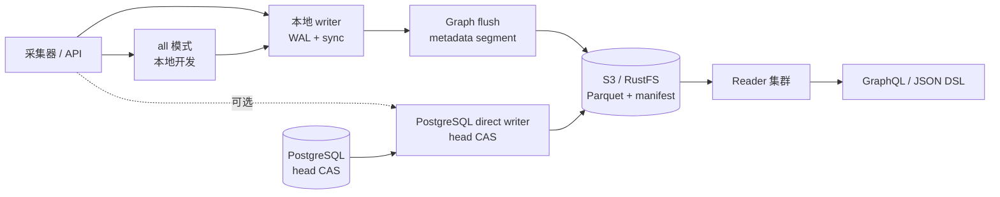

<div align="center">

# GGraphDB

**面向实体、关系与拓扑的通用当前态属性图数据库**

[](https://github.com/SamuelSupe/graphdb/actions/workflows/release.yml)
[](https://github.com/SamuelSupe/graphdb/releases/tag/v1.2.2)
[](https://go.dev/)

[English README](README.md) · [v1.2.2 发行版](https://github.com/SamuelSupe/graphdb/releases/tag/v1.2.2) · [Latest releases](https://github.com/SamuelSupe/graphdb/releases)

</div>

GGraphDB v1.2.2 是一个 Go 实现、以对象存储为持久化边界的通用当前态属性图，
用于实体和关系数据。知识库、资产图、服务依赖、数据血缘、拓扑、影响分析和
CMDB 都是应用场景，而不是不同的存储引擎。图模型保持通用：应用自定义的
kind、字段、关系类型、边、可选类型元数据以及租户隔离。

v1.2.0 引入了本地 writer 的性能优先默认路径：每个租户一个活跃 writer，
进程级分段 WAL、`sync` 耐久性和 metadata segment。只有 WAL 完成 fsync 后，
写入才会返回 durable ingest 响应。生产持久化建议使用共享对象存储；Parquet
segment、manifest、snapshot 和 index 都可以从对象存储恢复。

> **发行状态。** `v1.2.2` 是当前发行标识。源码工作区或 tag 本身不能证明发行
> 门禁已通过。权威证据是 v1.2.2 GitHub Release 资产、成功的发布工作流，以及
> 发行包中与 commit 绑定的 CAS 和回滚证据。

> **v1.2.0 基础运行合同。** 性能优先的本地 WAL 路径是默认模式：只有 WAL fsync
> 完成后才返回 durable `202 Accepted`；有界压力返回带 `Retry-After` 的
> `429`；发行资产只有在通过 commit-bound 验证证据后才会发布。

## v1.2.2 可靠性与查询更新

| 领域 | 改进 |
| --- | --- |
| Commit tail 与图加载 | compact 和重新加载复用已解码图状态；持久化 commit segment 并发加载，并继续按版本顺序应用。 |
| Reader 隔离 | 完整图冷加载在请求间共享并设置全局边界；缓存空闲驻留、加载超时和队列超时分别控制。加载完成信号发布前归还全局准入槽，避免已完成任务短暂阻塞下一租户。 |
| 查询延迟 | 查询校验提前到存储 I/O 之前；`timeout_ms` 覆盖准入、索引访问、图加载和执行；物化 kind 分页取得 `limit + 1` 条匹配后停止；不可用的延迟索引采用有界退避。 |
| 故障处理 | 查询 shape 在存储 I/O 前受限；任务停止、索引重建准入、restore 清理、coordinator 回滚和 WAL close 路径保留明确的终止错误。 |
| 发行证据 | 已发布的 `v1.2.2` 工作流通过 unit/vet/race、Python SDK、v1 兼容、RustFS/CAS/load/restore integration、双 writer 20 QPS 30 分钟 CAS soak 和回滚。 |

二进制、校验文件和 commit-bound evidence 见
[v1.2.2 发行版](https://github.com/SamuelSupe/graphdb/releases/tag/v1.2.2)。

## v1.2.0 基础能力一览

| 领域 | 合同 |
| --- | --- |
| 本地 writer 默认值 | `GRAPHDB_INGEST_MODE=wal`、`GRAPHDB_INGEST_METADATA_MODE=segment`、`GRAPHDB_INGEST_WAL_DURABILITY=sync`；graph flush 为 250 ms，trigger 为 8 请求 / 2 MiB，使用 2 个 worker；metadata flush 为 500 ms，trigger 为 256 请求 / 8 MiB，使用 2 个 worker。忙租户可合并同一轮队列。 |
| Durable ingest | `POST /v1/ingest/batches` 在 batch fsync 到本地 WAL 后返回 `202 Accepted`，并提供 `Location` 和状态资源。 |
| 查询可见写入 | 调用方需要最终 `200/207` 结果时发送 `Prefer: wait=committed`，而不是只等待 durable 异步接收。 |
| 有界准入 | 队列 80%、WAL 70% 或 pending age 2 分钟时返回带 `Retry-After` 的结构化 `429`；WAL 使用率达到 85% 后 readiness 进入 drain-only。 |
| 写入与维护安全 | 默认 write cache 为 4 GiB，commit-tail 上限为 20,000；后台重型任务默认单并发；每租户 ingest 空闲满 1 分钟后维护任务才会运行。 |
| 性能门禁 | 固定 OrbStack 主机，8 CPU/8 GiB，8 个租户、16 个采集器，v1.1.5 基线和候选各运行 5 次 30 分钟；accepted p95/p99 上限为 20/250 ms，结果只有在 v1.2.0 Release 打包 commit-bound evidence 后才具权威性。 |
| 兼容边界 | v1.1.5 → v1.2.0 在启用 segment metadata 后是单向数据升级；PostgreSQL 协调必须显式使用 direct ingest。 |

## 核心能力

| 能力 | 说明 |
| --- | --- |
| 多租户图数据 | 通过 `X-Tenant-ID` 隔离租户前缀、实体、边、ingest identity 和索引。 |
| 通用图内核 | 无固定 schema 的实体、有类型/方向的边、应用自定义 kind 与 relation type、JSON 字段、分页、流式查询、聚合、有界遍历和影响查询。 |
| 可选领域建模 | CI/entity type、继承、字段约束、identity key、关系 schema、source priority 以及适用于 CMDB 等 profile 的合并/拆分治理。 |
| 查询 API | GraphQL、JSON Query DSL 和自定义 GQL 文本端点；查询计划提供有界与准入控制，不承诺无界扫描。 |
| 写入与导入 | 幂等 direct commit、durable WAL batch、可恢复 JSONL/CSV 导入、collector 状态和结构化重试错误。 |
| 对象存储持久化 | Parquet commit/metadata segment、manifest、snapshot、entity page、edge shard 和可重建 index，支持本地或 S3 兼容存储。 |
| 运维能力 | health/readiness、compact、GC、backup/restore、repair、integrity audit、index health、metrics 和 reader freshness 控制。 |

## 架构一览



默认本地拓扑为每个租户一个活跃 writer，本地 WAL 是 durable acceptance 边界。
Reader 独立从共享对象存储加载数据。PostgreSQL 协调是可选的乐观多 writer
head-CAS 路径，不提供分布式 WAL；PostgreSQL writer 必须显式设置
`GRAPHDB_INGEST_MODE=direct`。

## 快速开始

### 本地文件存储

需要 Go 1.25 或更高版本。下面的显式环境变量展示 v1.2.0 本地 writer 默认值；
容器部署时请把 `GRAPHDB_DATA_DIR` 放在持久化存储上。

```sh
GRAPHDB_MODE=all \
GRAPHDB_STORAGE=local \
GRAPHDB_DATA_DIR=.graphdb \
GRAPHDB_INGEST_MODE=wal \
GRAPHDB_INGEST_METADATA_MODE=segment \
GRAPHDB_INGEST_WAL_DURABILITY=sync \
go run ./cmd/graphdb serve

curl -fsS http://127.0.0.1:8080/v1/health
```

### Docker Compose + MinIO

仓库提供的 profile 会把 writer 数据目录持久化到 named volume：

```sh
docker compose up --build
curl -fsS http://127.0.0.1:8080/v1/health
```

### RustFS Writer/Reader 拓扑

```sh
docker compose -f docker-compose.rustfs.yml up --build
curl -fsS http://127.0.0.1:38080/v1/health  # writer
curl -fsS http://127.0.0.1:38081/v1/health  # reader
```

### 创建租户、写入数据并查询

```sh
# 1. 创建租户
curl -fsS -X POST http://127.0.0.1:8080/v1/tenants \
  -H 'Content-Type: application/json' \
  -d '{"tenant_id":"demo","name":"Demo"}'

# 2. 写入示例图数据
curl -fsS -X POST http://127.0.0.1:8080/v1/commits \
  -H 'X-Tenant-ID: demo' \
  -H 'Content-Type: application/json' \
  -H 'Idempotency-Key: demo-commit-001' \
  --data @examples/commit.json

# 3. 使用 JSON Query DSL 查询
curl -fsS -X POST http://127.0.0.1:8080/v1/query \
  -H 'X-Tenant-ID: demo' \
  -H 'Content-Type: application/json' \
  --data @examples/query-match.json

# 4. 使用 GraphQL 查询通用图数据
curl -fsS -X POST http://127.0.0.1:8080/v1/query/graphql \
  -H 'X-Tenant-ID: demo' \
  -H 'Content-Type: application/json' \
  -d '{"query":"query Find($request: QueryRequest!) { graph(request: $request) { version results stats } }","operationName":"Find","variables":{"request":{"op":"match","kind":"person","where":[{"field":"name","op":"eq","value":"Alice"}],"project":["id","name"],"limit":10}}}'
```

写入响应中的 `version` 可以作为 reader 查询的 `min_version`，保证读到指定
版本；只有在明确接受最终一致性时才使用 `allow_stale=true`。

## Durable ingest 与有界背压

默认 batch endpoint 会先确认 durable WAL append，再完成 graph flush：

```sh
curl -i -X POST http://127.0.0.1:8080/v1/ingest/batches \
  -H 'X-Tenant-ID: demo' \
  -H 'Content-Type: application/json' \
  -H 'Idempotency-Key: demo-batch-001' \
  -d '{"source":"agent","collector_id":"collector-a","batch_id":"demo-batch-001","idempotency_key":"demo-batch-001","items":[]}'
```

本地 WAL 模式会在 fsync 后返回 durable `202 Accepted`，并给出状态 URL。可以
使用同一个租户 header 轮询该 URL；如果调用方需要最终查询可见结果，可以直接：

```sh
curl -i -X POST http://127.0.0.1:8080/v1/ingest/batches \
  -H 'X-Tenant-ID: demo' \
  -H 'Content-Type: application/json' \
  -H 'Prefer: wait=committed' \
  -H 'Idempotency-Key: demo-batch-002' \
  -d '{"source":"agent","collector_id":"collector-a","batch_id":"demo-batch-002","idempotency_key":"demo-batch-002","items":[]}'
```

`Prefer: wait=committed` 会等待 durable metadata segment，并返回最终 `200` 或
`207`。当准入受到限制时，writer 返回带 `Retry-After`、`retry_after_ms` 和
结构化 `reasons` 的 `429`，原因可能是队列、WAL 或最老 pending 请求年龄。
重试时复用相同的 `batch_id` 和 `idempotency_key` 并退避；不要为同一 source
page 生成新的 identity。

## 通用图场景：使用 GraphQL 查询

`examples/commit.json` 包含一个非 CMDB 的通用图：`person:alice` 通过
`works_at` 关系连接到 `company:acme`。GraphQL 通过 `QueryRequest` 变量接收
通用 JSON Query DSL，因此应用自定义的实体类型、字段和关系类型同样适用于
组织关系、项目依赖、数据血缘和其他图结构数据。

GraphQL document：

```graphql
query FindPerson($request: QueryRequest!) {
  graph(request: $request) {
    version
    results
    stats
  }
}
```

变量使用 `{"op":"match","kind":"person",...}`；要沿关系查询一跳邻居，可改为
`{"op":"neighbors","id":"person:alice","relation_types":["works_at"]}`。

参见 [GraphQL 文档](docs/graphql.zh-CN.md)、[自定义 GQL 文档](docs/gql.md) 和
[查询能力地图](docs/query_capabilities.md)。`/v1/query/graphql` 是 GraphQL；
`/v1/query/gql` 是 GGraphDB 自定义的 `FIND`/`MATCH` 文本端点，不是 SPARQL。

## 产品定位与边界

GGraphDB 是通用的当前态**属性图**。CMDB 治理是可选的应用 profile，不是内核
的产品上限。v1.2.0 不宣称 RDF 原生存储、RDF 无损往返、SPARQL、OWL 推理、
named graph、blank node、RDF 多 `rdf:type`、typed/language literal、历史图
查询、Cypher/Gremlin 兼容、subquery、join、UDF 或表达式计算。遇到这些边界时，
请使用属性图模型以及文档化的 GraphQL/JSON/GQL API。

## 部署模式

| 模式 | 适用场景 | 行为 |
| --- | --- | --- |
| `all` | 本地开发、小规模单进程部署 | 同一进程处理写入和查询；local coordination 使用 WAL 默认值。 |
| `writer` | 生产写入入口 | 写入和控制 API；每租户一个 local writer，或显式 PostgreSQL 协调的 direct writer。 |
| `reader` | 查询集群 | 从共享对象存储加载数据，提供查询和导出；不接受写入。 |

生产部署建议使用共享 S3/RustFS 和多个 reader。默认
`GRAPHDB_COORDINATION=local` 时每租户保持一个 writer。使用 PostgreSQL 协调时
设置 `GRAPHDB_INGEST_MODE=direct`；2–8 个乐观 writer 是独立的正确性/CAS 门禁，
不是本地 WAL 路径。`X-Tenant-ID` 是路由标识，不是认证机制；认证、授权、TLS
和限流应由网关或服务网格提供。

## 发行版

当前发行版是 [GGraphDB v1.2.2](https://github.com/SamuelSupe/graphdb/releases/tag/v1.2.2)，[Latest releases](https://github.com/SamuelSupe/graphdb/releases) 是公开发行索引。
其已发布工作流通过验证、RustFS/CAS/load/restore integration、双 writer 20 QPS
30 分钟 CAS soak 和回滚，并打包了绑定提交 `412a4999` 的证据。

`main` 上的工作流为未来 tag 保留固定主机本地 WAL 性能门禁。打包前会校验
`artifacts/wal-performance/gate.json`，其中必须有 5 次基线、5 次候选、
阈值结果和 commit 绑定。性能门禁失败就不会产出对应发行归档。
这是下文记录的 v1.2.0 验收合同，不能把它表述成额外的 v1.2.2 证据。

性能合同是明确的门禁，不是本文的 benchmark 结果：固定 8 CPU/8 GiB OrbStack
主机运行 8 个租户、16 个采集器，v1.1.5 基线和 v1.2.0 候选各 5 次 30 分钟。
候选阈值包括至少 10,000 committed mutations/s，中位吞吐比至少 1.5，运行间
离散不超过 5%，accepted p95/p99 不超过 20/250 ms，committed p95/p99 不超过
8/15 秒，RSS 不超过 7 GiB 和基线的 110%，每 1,000 mutation 的 CPU 不超过
基线 75%，direct 写入和查询回归不超过 10%。这些是发行阈值；测量结果只有在
v1.2.0 GitHub Release 打包对应的 commit-bound 矩阵证据后才具权威性。

详见[容量边界](docs/capacity.zh-CN.md)、[发行 checklist](docs/release-checklist.md)
和[发行版部署文档](docs/user/release-deployment.zh-CN.md)。每个发行包包含 Linux
amd64、Linux arm64、macOS arm64 静态二进制、校验和、Compose profile、examples、
SDK、OpenAPI 以及 workflow 接受的发行证据。为兼容旧部署流程，`release_*` 标签
仍然受支持。

## 文档入口

| 文档 | 内容 |
| --- | --- |
| [数据库简介](docs/database-introduction.zh-CN.md) · [English](docs/database-introduction.md) | 产品定位、数据模型、架构和当前边界。 |
| [使用手册](docs/user/usage-manual.zh-CN.md) · [English](docs/user/usage-manual.md) | 租户、写入、查询、可选的 CMDB 场景能力、索引、维护和 SDK。 |
| [部署与运维](docs/user/deploy-ops.zh-CN.md) · [English](docs/user/deploy-ops.md) | `all`/`writer`/`reader`、S3、RustFS、健康检查和生产规则。 |
| [安全边界](docs/security-deployment.zh-CN.md) · [English](docs/security-deployment.md) | 数据/管理 listener、网关认证、租户绑定、RBAC 与 TLS。 |
| [容量边界](docs/capacity.zh-CN.md) · [English](docs/capacity.md) | 固定主机发行阈值、可复现基线和推荐拓扑。 |
| [发行版部署](docs/user/release-deployment.zh-CN.md) · [English](docs/user/release-deployment.md) | Release 下载、校验、升级、回滚和安全边界。 |
| [读与查询](docs/user/read-query.zh-CN.md) · [English](docs/user/read-query.md) | GraphQL、JSON DSL、分页、流式、explain 和 profile。 |
| [写入与采集](docs/user/write-ingest.zh-CN.md) · [English](docs/user/write-ingest.md) | direct commit、WAL/segment ingest、durable `202`、`Prefer`、幂等和背压。 |
| [数据模型](docs/user/data-model.zh-CN.md) · [English](docs/user/data-model.md) | tenant、可选 CI type、entity、relation、edge 和数据治理。 |
| [API Map](docs/user/api-map.zh-CN.md) · [English](docs/user/api-map.md) | 按领域整理的 HTTP endpoint 清单。 |
| [OpenAPI](docs/openapi.yaml) | HTTP API 合同，也可通过 `GET /openapi.yaml` 获取。 |
| [Go/Python SDK](docs/user/sdk.zh-CN.md) · [English](docs/user/sdk.md) | SDK 初始化、读写、流式、durable ingest 和重试指导。 |
| [全部用户指南](docs/user/README.zh-CN.md) · [English](docs/user/README.md) | 完整 API、部署、运维和故障排查入口。 |

## 开发

```sh
# 单元、vet 和 race 检查
go test -mod=readonly ./...
go vet -mod=readonly ./...
go test -mod=readonly -race ./...

# 校验部署拓扑语法
docker compose config
docker compose -f docker-compose.rustfs.yml config
```

正式发行性能矩阵是长时间检查，只应在干净、commit-bound 的工作区和固定
OrbStack 主机上运行：

```sh
scripts/wal_performance_matrix.sh
```

仓库还包含位于 `tools/` 和 `scripts/` 下的黑盒 e2e、负载、soak、恢复和发行版
门禁工具。运行长时间或有影响的检查前，请先阅读对应的运维文档。

## 贡献与许可证

详见 [CONTRIBUTING.md](CONTRIBUTING.md)、[SECURITY.md](SECURITY.md) 和
[LICENSE](LICENSE)。当前许可证为 rights-reserved；源码公开不代表授予
生产使用或再分发权利。
