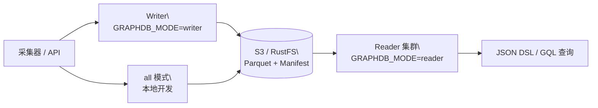

<div align="center">

# GraphDB

**面向 CMDB 与 IT 拓扑的对象存储图数据库**

[](https://github.com/SamuelSupe/graphdb/releases)
[](https://github.com/SamuelSupe/graphdb/actions/workflows/release.yml)
[](https://github.com/SamuelSupe/graphdb)

[English README](README.md) · [最新发行版](https://github.com/SamuelSupe/graphdb/releases/latest)

</div>

GraphDB 是一个 Go 实现的 v1 图数据库，面向 CMDB、资产关系、服务依赖和
影响分析场景。它把租户数据持久化到本地磁盘或 S3 兼容对象存储，使用
Parquet、manifest CAS、快照和提交回放，提供可追踪的写入版本与可控的新鲜度。

## 核心能力

| 能力 | 说明 |
| --- | --- |
| 多租户图数据 | 通过 `X-Tenant-ID` 隔离租户前缀、实体、边和索引。 |
| CMDB 建模 | CI type、字段约束、identity reconciliation、source priority 和人工合并/拆分。 |
| 图查询 | JSON Query DSL、GQL、match、neighbors、traverse、impact、shortest path。 |
| 对象存储持久化 | Parquet manifest、commit、snapshot、entity page、edge shard 和 index object。 |
| 读写分离 | 同一二进制支持 `all`、`writer`、`reader`，通过部署拓扑分流。 |
| 运维能力 | compact、GC、backup/restore、repair、integrity audit、index health 和 metrics。 |

## 架构一览



## 快速开始

### 本地文件存储

需要 Go 1.25 或更高版本：

```sh
go run ./cmd/graphdb serve
curl -fsS http://127.0.0.1:8080/v1/health
```

### Docker Compose + MinIO

```sh
docker compose up --build
curl -fsS http://127.0.0.1:8080/v1/health
```

### RustFS Writer/Reader 拓扑

```sh
docker compose -f docker-compose.rustfs.yml up --build
curl -fsS http://127.0.0.1:38080/v1/health  # writer
curl -fsS http://127.0.0.1:38081/v1/health  # reader
```

### 创建租户、写入数据并查询

```sh
# 1. 创建租户
curl -fsS -X POST http://127.0.0.1:8080/v1/tenants \
  -H 'Content-Type: application/json' \
  -d '{"tenant_id":"demo","name":"Demo"}'

# 2. 写入示例图数据
curl -fsS -X POST http://127.0.0.1:8080/v1/commits \
  -H 'X-Tenant-ID: demo' \
  -H 'Content-Type: application/json' \
  -H 'Idempotency-Key: demo-commit-001' \
  --data @examples/commit.json

# 3. 使用 JSON Query DSL 查询
curl -fsS -X POST http://127.0.0.1:8080/v1/query \
  -H 'X-Tenant-ID: demo' \
  -H 'Content-Type: application/json' \
  --data @examples/query-match.json

# 4. 使用 GQL 查询
curl -fsS -X POST http://127.0.0.1:8080/v1/query/gql \
  -H 'X-Tenant-ID: demo' \
  -H 'Content-Type: text/plain' \
  --data-binary 'FIND person WHERE name = "Alice" LIMIT 10'
```

写入响应中的 `version` 可以作为 reader 查询的 `min_version`，保证读到指定
版本；只有在明确接受最终一致性时才使用 `allow_stale=true`。

## 部署模式

| 模式 | 适用场景 | 行为 |
| --- | --- | --- |
| `all` | 本地开发、小规模单进程部署 | 同一进程处理写入和查询。 |
| `writer` | 生产写入入口 | 写入和控制 API；每个租户保持一个活跃 writer。 |
| `reader` | 查询集群 | 从共享对象存储加载数据，提供查询和导出。 |

生产部署建议使用共享 S3/RustFS、每个租户一个 writer、多个 reader，并以
reader fleet readiness 作为流量接入条件。`X-Tenant-ID` 是租户路由标识，
不是认证机制；认证、授权、TLS 和限流应由网关或服务网格提供。

## 发行版

当前发行版：
[**release_20260722_01**](https://github.com/SamuelSupe/graphdb/releases/tag/release_20260722_01)。

发行包包含：

- Linux amd64、Linux arm64、macOS arm64 静态二进制；
- Dockerfile、MinIO/RustFS Compose 文件和 examples；
- 部署、使用、API、查询和 SDK 文档；
- `.sha256` 校验文件。

详见[发行版部署文档](docs/user/release-deployment.md)。推送匹配
`release_*` 的标签会触发 [GitHub Actions](.github/workflows/release.yml)，
自动构建并发布归档包。

## 文档入口

| 文档 | 内容 |
| --- | --- |
| [数据库简介](docs/database-introduction.md) | 产品定位、数据模型、架构和当前边界。 |
| [使用手册](docs/user/usage-manual.md) | 租户、写入、查询、CMDB、索引、维护和 SDK。 |
| [部署与运维](docs/user/deploy-ops.md) | `all`/`writer`/`reader`、S3、RustFS、健康检查和生产规则。 |
| [发行版部署](docs/user/release-deployment.md) | Release 下载、校验、升级、回滚和安全边界。 |
| [读与查询](docs/user/read-query.md) | JSON DSL、GQL、分页、流式、explain 和 profile。 |
| [写入与采集](docs/user/write-ingest.md) | commit、ingest、幂等、删除、source policy 和背压。 |
| [数据模型](docs/user/data-model.md) | tenant、CI type、entity、relation、edge 和数据治理。 |
| [API Map](docs/user/api-map.md) | 按领域整理的 HTTP endpoint 清单。 |
| [OpenAPI](docs/openapi.yaml) | HTTP API 合同，也可通过 `GET /openapi.yaml` 获取。 |
| [Go/Python SDK](docs/user/sdk.md) | SDK 初始化、读写、流式访问和重试指导。 |

## 当前边界

GraphDB v1 目前明确保持以下边界：

- 每个租户一个活跃 writer，不提供分布式事务协调器；
- 对象存储是生产持久化的推荐来源；
- 强读场景通过显式 reader freshness 控制；
- 认证和授权由部署边界负责。

详细限制和成熟度缺口见[功能缺口跟踪](docs/product_function_gaps.md)。

## 开发

```sh
# 单元测试和包测试
go test -mod=mod ./...

# 校验两种部署拓扑
docker compose config
docker compose -f docker-compose.rustfs.yml config
```

仓库还包含位于 `tools/` 和 `scripts/` 下的黑盒 e2e、负载、soak、
reader freshness、恢复和发行版门禁工具。运行长时间或有影响的检查前，
请先阅读对应的运维文档。

## 贡献与许可证

欢迎通过 issue 或 pull request 提交 bug、部署反馈和功能建议。请勿将租户
数据、凭据和本地生成状态提交到仓库。
