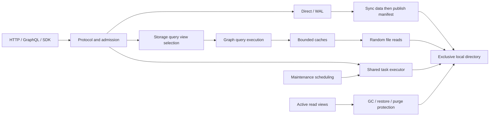

# GGraphDB 2.x Local Disk Architecture

[中文](architecture.md)

The default deployment runs as one process on one machine, with concurrent reads and writes across tenants. Optional [Raft HA](raft-ha.zh-CN.md) defaults to three independent local-disk replicas per group. [Tenant sharding](sharding.zh-CN.md) places and migrates whole tenants across data groups.
Parquet commits, snapshots and indexes remain the durable representation. An optional WAL
provides durable ingestion acceptance and replay. Object storage is an optional backup destination.

## Writes and publication

Foreground publication is serialized per tenant; different tenants can proceed concurrently.
Referenced files and their directories are synchronized before manifest/catalog publication.
The pointer replacement is atomic; the preceding multi-file writes are not a transaction.
Partition encoding shares four slots and cooperative file-count, 16 MiB and 50 ms budgets.

Entities, edges, adjacency and field indexes use 256 copy-on-write partitions; small collections
of up to 32 entries use compact maps. Incremental partitioned SHA-256 produces `data_hash`.

The [unreleased head-integrity fix](product-p0-p1-review2-2026-10-03.zh-CN.md)
rejects ordinary reads and publication when the manifest is missing but graph
objects remain. Cold full-graph loads also verify `sha256-shards-v2` digests;
empty or legacy digests remain readable without that additional check. Partial
Parquet/index queries and published memory views do not recompute the full graph
digest on every request. This does not replace deep integrity audits or detect
replacement of the entire directory with another internally consistent dataset.

An implicit first write persists its empty head before staging the commit, preserving
failed-publication retries. Explicit snapshot source identities are authoritative:
provenance ownership and the external ID may originate from different sources and
must not be combined into a new identity. The review documents the upgrade limits
for datasets affected by the source-identity correction.

WAL acceptance, grouped publication, idempotency and crash replay retain their existing protocol.
An accepted request is not yet a published graph version.

The [unreleased replication-integrity fix](product-p0-p1-review4-2026-10-03.zh-CN.md)
binds staged migration chunks to their actual SHA256 and total byte count in
replicated ownership. Loss or alteration of acknowledged chunks stops the faulty
replica without consuming the install entry. Raft snapshots cold-load graphs and
relation schemas in the captured source view and decoded target before replacement;
streaming source validation runs in the background builder. Legacy unfinished
staging must be cancelled and transferred again before cutover.

The same fix binds Raft data directories and new commands to `GRAPHDB_PREFIX`.
An older directory is checked for foreign business objects before its local
prefix identity is first saved. Restart mismatches are rejected. Snapshot
validation checks every object namespace before replacement, including archives
with no tenants under the configured prefix, and preserves the target's local
identity. Legacy commands without the field remain readable; all voters must
retain the original prefix during mixed-version operation.

`TenantStore` publishes durable immutable graphs to attached read caches. Direct commits, WAL,
recovery and compaction use this shared path. HTTP handlers and WAL bootstrap no longer update
read caches separately. Publication does not depend on whether the writer cache retains the graph.
File replacement invalidates views, including restore to a lower or equal version.

The [unreleased migration fix](product-p0-p1-review3-2026-10-03.zh-CN.md) validates the complete graph, current digest and relation schemas from the copied files. Exclusively opened local targets publish a staged directory using the recovery journal. Source read or validation failure preserves the previous target; Raft rejects invalid install input before changing incarnation or ownership. Dry-run is an inventory, and arbitrary non-local object-store replacement has no directory-level atomicity.

## Reads and reclamation

Parquet reads use closable random-access files with column and row-group selection. Decode
admission and cache limits remain bounded. Buffered and streaming queries share storage-level
index selection, freshness constraints and failure backoff. Request metadata reuse is scoped to
the store and tenant; it does not replace active read-view protection.

GC retires unreferenced files against active read epochs and defers only reclamation needed by
older views. New queries can enter during GC. A changed manifest/catalog invalidates the batch
proof, including same-version index publication. Retirement bookkeeping is bounded; overflow
conservatively defers deletion. Restore, purge and explicit recovery/commit cleanup remain
exclusive lifecycle operations. `checkpoint.deferred_files` can be nonzero even when a scan
completed; maintenance retries reclamation. Caches share publication generations and immutable
graphs, while their retention budgets remain separate. Idle eviction replaces freshness polling.

## Tasks and directory ownership

New index rebuilds are ordinary `index_rebuild` tasks, sharing queue limits, cancellation, retry,
progress and terminal-state persistence with other operations. Index endpoints retain their
response shape. Existing separately stored index task records remain readable. Definition
changes can queue a replacement; progress from its predecessor cannot replace the active task.
Index cleanup yields execution capacity between batches.

The runtime registry identifies active local tasks. Cancellation signals the execution context
directly; local cancellation polling and GC heartbeats are unnecessary. After restart, orphaned
active records are marked failed when inspected/reconciled and can be retried using supported
checkpoints. This is not automatic replay of every task. WAL replay remains a separate protocol.

The directory lock excludes other processes. The persisted writer token/epoch fences previous
tenant generations; local operation does not depend on lease expiration or renewal. Conditional
writes, content checks and generation checks remain in place. Cached generation records are
validated using file metadata to avoid repeated Parquet decoding.

The runtime cancels and joins task, index and maintenance workers before releasing the data
directory. WAL shutdown is included and errors propagate to service/CLI callers. A worker timeout
retains directory ownership until a successful shutdown retry.

## Backup automation

This internal automation applies to standalone. Raft uses external scheduling through the cluster backup API; see [Raft operations](raft-operations.zh-CN.md).

The maintenance runner schedules durable ordinary backup tasks, with restart recovery, retry
backoff, full download verification, optional isolated restore drills and bounded S3 retention.
No separate scheduler or task execution engine is introduced. See [object backups](object-backup.md).

## Module boundaries

| Module | Responsibility |
| --- | --- |
| `internal/httpapi` | HTTP/GraphQL protocol, tenant routing, admission, responses and tracing; external gateways handle authentication/authorization |
| `internal/storage` | Persistence, tenant generations, read views, publication, query index selection and task lifecycle |
| `internal/maintenance` | Scheduling and decisions using storage operations/budgets, with usage and audit callbacks |
| `internal/graph` / `internal/query` | Graph structures, planning and execution |
| `internal/backupstore` | Optional object-storage backup transport, outside online reads/writes |

Local file access retains narrow interfaces for testing and observation, random reads and bounded
directory scans. The unused single-writer wrapper is removed. Maintenance scheduling can run
without an HTTP server.

## Deployment and compatibility

The service and offline CLI exclusively own `GRAPHDB_DATA_DIR`. Use HTTP for maintenance while
the service is running. The layout remains `<prefix>/tenants/<tenant>/`, with manifest, commits,
snapshots, indexes, config and tasks. This simplification preserves released 2.0 Parquet/WAL data
and does not introduce another metadata encoding.

Remote primary storage, PostgreSQL coordination and split reader/writer modes are rejected.
Optional [Raft HA](raft-ha.zh-CN.md) provides replication and leader failover using fresh independent directories. See the [local disk guide](local-disk.md) for
configuration and validation, and [version boundaries](naming-and-compatibility.md) for the
2.0 break from 1.x data and the old MD5 contract.
