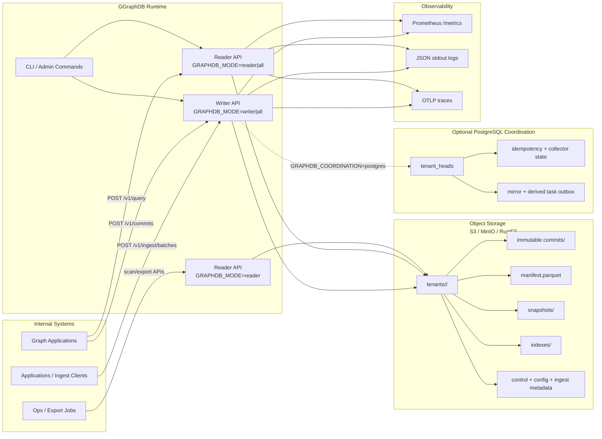
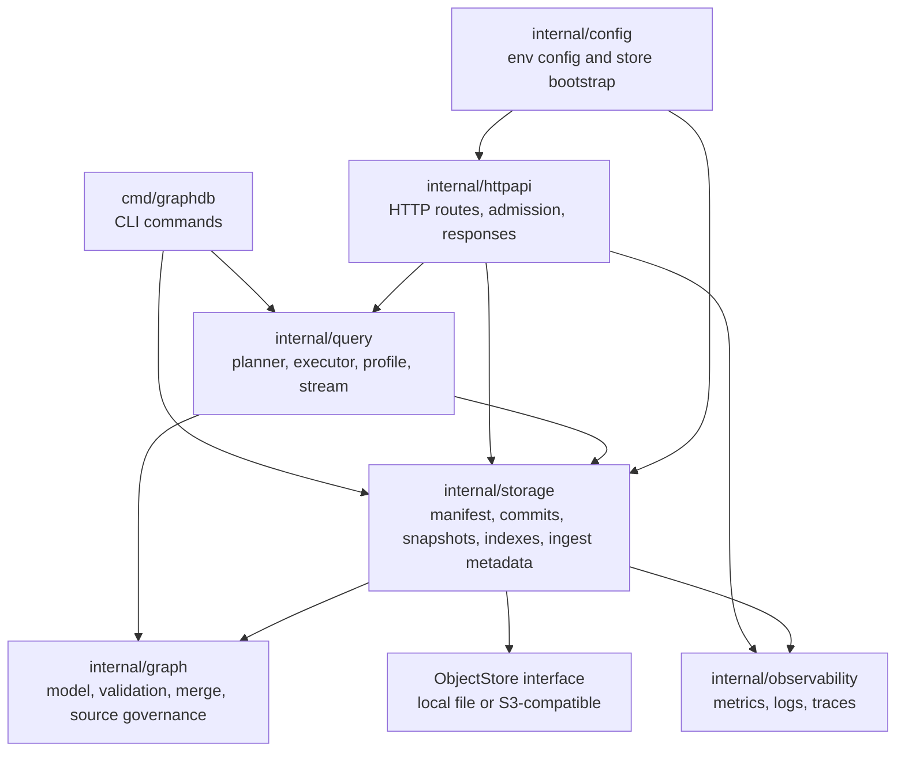
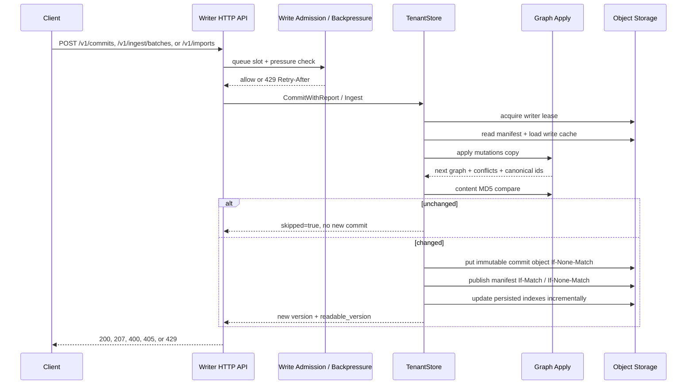
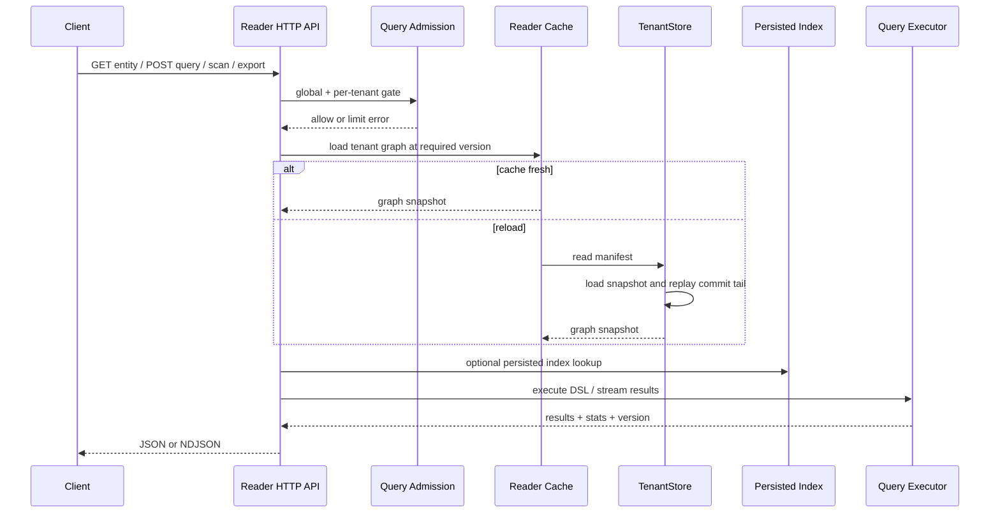
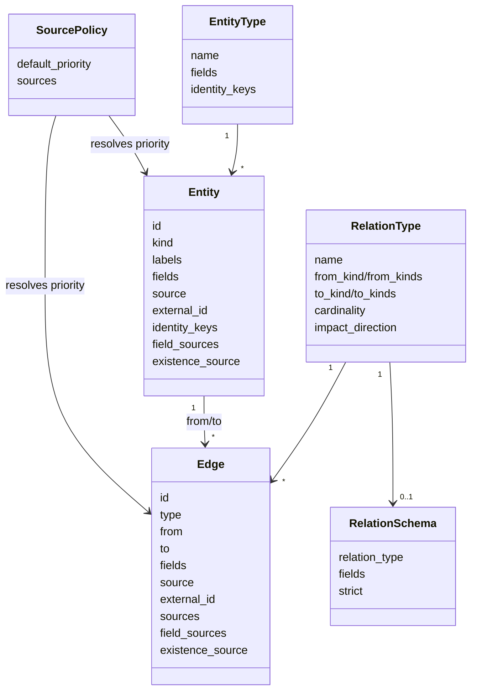
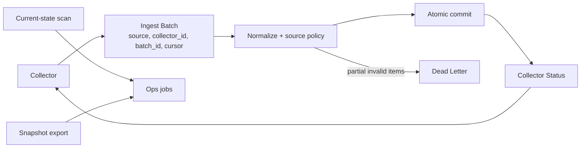

# GGraphDB 图数据库整体架构

本文说明 GGraphDB 作为通用实体关系图数据库的整体产品架构。GGraphDB 是一个基于 S3/MinIO/RustFS 兼容对象存储的多租户、读写分离图数据库，面向实体、关系、写入接入、查询、导出和运维控制场景；CMDB、IT 拓扑和依赖分析是其中的应用场景。

## 1. 产品定位

GGraphDB 的核心目标是作为通用实体关系图数据底座，并通过可选的领域能力支持 CMDB 等场景：

- 本地协调以对象存储 manifest 为权威状态；可选 PostgreSQL 协调以 tenant head
  为权威状态，对象存储只保存不可变数据对象和 1.0 兼容镜像。
- 以租户 prefix 隔离数据，HTTP 侧通过 `X-Tenant-ID` 选择租户。
- 写入侧默认采用单租户单 writer；可选 PostgreSQL head CAS 允许同租户多 writer
  乐观并发，二者复用同一 commit log 和对象布局。
- 读取侧加载 manifest 对应快照和增量 commit，支持 reader cache 和最终一致读取。
- 查询侧提供 JSON DSL、当前态 scan/export、流式查询和 persisted index 加速。
- 采集侧支持 batch ingestion、source cursor、idempotency、dead-letter、source priority 治理。

## 2. 总体部署架构

## 3. 逻辑模块架构

模块职责：

- `httpapi`: HTTP API、读写模式控制、query/write admission、429 backpressure、审计日志。
- `graph`: Entity、Edge、可选 EntityType（CIType 兼容别名）、标签、RelationType、source priority、字段归属、关系三元组 canonical identity。
- `storage`: 对象存储读写、manifest/head CAS、writer/task fencing、commit replay、snapshot compact、正反向 index rebuild、ingest/import、关系属性 schema 和 dead-letter。
- `query`: JSON DSL、planner、index lookup、lazy materialization、path traversal、streaming。
- `observability`: Prometheus 指标、stdout JSON 日志、OTLP trace。
- `cmd`: 本地和运维 CLI。

## 4. 写入路径

写入关键点：

- commit object 先写入，manifest 发布成功前读端不可见；loose commit object 使用 Parquet 保存 commit identity、payload hash 和 commit payload，JSON commit envelope 和裸 `graph.Commit` JSON 不再是合法数据面对象。
- 长 commit tail 会折叠为 manifest 中的 `commit_segments`，segment 对象使用 Parquet 保存 commit key + commit，读端先回放 segment 再回放 loose commit；gzip NDJSON segment 不再是合法数据面对象。
- `local` 协调下 manifest 使用 ETag 条件写，writer lease 防止误启的第二写端；
  CAS 冲突会 retry 或暴露为 backpressure 信号。
- `postgres` 协调下 writer 读取 PG head 和不可变 write-context，写不可变
  commit/manifest 后条件更新 head；冲突会重新加载并按现有合并规则最多重放
  `GRAPHDB_WRITE_CAS_MAX_RETRIES` 次（不含首次尝试），并使用 5–200ms
  随机退避。
- PG head CAS、幂等结果、collector cursor、legacy mirror outbox 和派生索引任务
  在同一事务提交；`expected_version` 冲突不重放。
- 已提交幂等记录、超过窗口的遗留 pending reservation 和已完成 mirror
  outbox 按保留窗口分批清理；outbox 只有在 mirror watermark 已越过对应
  revision 后才能删除，outbox 的 pending/running 记录不清理。
- MD5 一致时跳过提交，避免重复写入造成 commit tail 增长。
- source priority 在字段级和 edge existence/field 级治理覆盖冲突。
- 低优先级 suppressed conflict 不算失败，不进入 dead-letter。

## 5. 读取和查询路径

读取关键点：

- reader 按 `GRAPHDB_POLL_INTERVAL` 或 writer invalidation 刷新。
- 查询支持 GraphQL 入口，以及 `match`、1-8 步 `pattern`、`neighbors`、
  `traverse`、`impact`、`shortest_path`、`explain`、`profile`；GraphQL 见
  [graphql.zh-CN.md](graphql.zh-CN.md)，详细 JSON DSL 见
  [query_capabilities.md](query_capabilities.md)。1.0 旧文本 DSL 仅保留兼容入口。
- 当前态运维导出使用 scan/export API，不依赖复杂 DSL。
- persisted index 可加速 field match、正向/反向 neighbors 与 pattern、entity by-id 和 entity page 读取。

## 6. 对象存储布局

```mermaid
flowchart TB
  Tenant["GRAPHDB_PREFIX/tenants/<tenant>/"]
  Manifest["manifest.parquet\ncurrent visible version"]
  Commits["commits/\n00000000000000000001-<id>.parquet"]
  CommitSegments["commits/segments/\n<first>-<last>-<hash>.parquet"]
  CommitIdempotency["idempotency/commits/<key>.parquet"]
  Snapshots["snapshots/\n<version>.parquet"]
  SnapshotCatalog["snapshots/sharded/v<version>/catalog.parquet"]
  SnapshotSchema["snapshots/sharded/v<version>/schema.parquet"]
  IndexCatalog["indexes/catalog.parquet"]
  IndexDefinitions["indexes/definitions.parquet"]
  FieldIndexes["indexes/parquet/versions/v<version>/fields/<kind>/<field>.parquet"]
  EdgeShards["indexes/parquet/versions/v<version>/edges/<relation>/<from-shard>.parquet"]
  Extensions["extensions/v1.1/relation-schemas.json\nextensions/v1.1/reverse-index/"]
  Retrieval["extensions/v1.2/retrieval/\ndefinitions.parquet\nhead.parquet\ncatalogs/*.parquet\ngenerations/*/versions/*"]
  EntityPages["indexes/parquet/versions/v<version>/entities/pages/<shard>.parquet"]
  EntityByID["indexes/entities/by-id/<entity-id>.parquet"]
  TenantRegistry["../_registry.parquet"]
  TenantMetadata["metadata.parquet"]
  Config["config/source-policy.parquet\nconfig/tenant-config.parquet"]
  SavedQueries["queries/<name>.parquet"]
  Ingest["ingest/<source>/\nbatches/*.parquet\nidempotency/*.parquet\ncollectors/*.parquet\ndeadletters/*.parquet"]
  Tasks["tasks/<task-id>.parquet\ntasks/results/<task-id>.parquet"]
  IndexTasks["indexes/tasks/<task-id>.parquet"]
  Control["control/writer-lease.parquet\ncontrol/readers/*.parquet"]

  Tenant --> Manifest
  Tenant --> TenantMetadata
  Tenant --> Commits
  Tenant --> CommitSegments
  Tenant --> CommitIdempotency
  Tenant --> Snapshots
  Tenant --> SnapshotCatalog
  SnapshotCatalog --> SnapshotSchema
  Tenant --> IndexCatalog
  Tenant --> IndexDefinitions
  IndexCatalog --> FieldIndexes
  IndexCatalog --> EdgeShards
  Tenant --> Extensions
  Tenant --> Retrieval
  IndexCatalog --> EntityPages
  IndexCatalog --> EntityByID
  TenantRegistry --> Tenant
  Tenant --> Config
  Tenant --> SavedQueries
  Tenant --> Ingest
  Tenant --> Tasks
  Tenant --> IndexTasks
  Tenant --> Control
```

布局原则：

- 每个租户独立 prefix，禁止跨租户读取。
- `manifest.parquet` 是读端可见性边界。
- `commits/` 是不可变提交日志。
- `idempotency/commits/` 保存直接提交幂等记录，使用 Parquet。
- `snapshots/` 是 compact 后的基线；新的 full snapshot、sharded snapshot catalog/schema 和 shard data 都使用 Parquet。
- `indexes/` 是可重建的读优化结构，不是最终真源；index definitions、catalog、secondary index、edge shard、entity page 和 by-id record 都使用 Parquet，非 Parquet index data 不会被解释为数据面对象。
- `extensions/v1.1/` 保存不改变 1.0 核心布局的关系属性 schema 和可重建反向
  邻接 shard；1.0 进程可以忽略该目录。
- `extensions/v1.2/retrieval/` 保存 GraphRAG definition、不可变 catalog、
  vector/lexical/chunk segment 和 CAS head。head 只会指向已经完整校验的
  Parquet 对象；该目录不修改 layout version 2 的 manifest、entity、edge
  或 graph index catalog，1.0/1.1 reader 可以忽略。
- reader 进程对 Parquet secondary index、edge shard、entity page 使用本地版本化 cache；cache key 包含 tenant、catalog version、object key、catalog content hash 和 schema hash，内存 LRU 可配，磁盘 cache 位于 `GRAPHDB_READER_INDEX_CACHE_DIR`。
- tenant registry、tenant metadata、writer lease 已使用 Parquet。
- source policy、tenant config、saved query、task、index task 和 task result 已使用 Parquet。
- `ingest/` 保存采集批次、幂等记录、collector status 和 dead-letter，均使用 Parquet 控制对象。
- reader heartbeat 保存在 `control/readers/*.parquet`，reader fleet readiness 不读取 JSON heartbeat 对象。

## 7. 数据模型和治理

治理规则：

- Entity 支持 schemaless `fields` 和标签；EntityType（1.0 的 CIType）提供可选字段规范和 identity key。
- Entity 字段按 `field_sources` 记录来源归属，优先级高的 source 覆盖低优先级。
- Edge 的真实身份是 `(type, from, to)`，`edge.id` 为 canonical ID，采集器原始 ID 作为 source alias。
- Edge existence 和 edge field 同样受 source priority 治理。
- RelationType 定义端点 kind、方向、基数和影响分析方向。
- RelationSchema 选择性约束边属性类型、必填、枚举、默认值和 strict 模式。

## 8. Ingestion 和运维导出

- Ingestion 适合采集器批量写入，支持 cursor、batch id、idempotency key。
- Direct commit 适合内部服务直接提交图 mutation。
- Dead-letter 保存失败项，支持后续 replay。
- Scan/export API 面向运维导出和同步，不走复杂查询 planner。

## 9. 控制面和可靠性

控制面能力：

- writer lease: 防止同租户误启的第二写端或陈旧写端发布；不是多 writer 调度层。
- recover: 扫描孤儿 commit，按连续版本恢复 manifest。
- repair: dry-run 或 apply deterministic repair，包括 compact、rebuild index、cleanup。
- cleanup-commits: 清理 manifest 已不引用的旧 commit。
- gc: 清理过期 dead-letter、旧 snapshot、index orphan；支持 dry-run、删除预算和 cursor checkpoint 续跑。
- index rebuild: 同步或异步重建 persisted index。
- backpressure: 基于对象存储延迟、CAS 冲突、index rebuild、commit tail、tenant quota 返回 429。
- storage maintenance: small-file 阈值可触发 compact，entity page / edge shard split/merge 阈值会进入维护报告，作为后续在线布局迁移的安全输入。

可靠性边界：

- 图 payload 的持久化真源是对象存储；可见 head 在本地模式由 manifest、
  PostgreSQL 模式由 PG tenant head 决定，reader 本地缓存和索引均可重建。
- commit 原子性以 manifest 发布为可见边界。
- snapshot compact 降低 replay 成本，但不改变可见版本语义。
- persisted index 是优化结构，catalog stale 时查询可回退。
- PostgreSQL 模式中 PG head 是唯一权威可见性边界；PG 不可用时写入 fail-closed，
  reader 只能继续提供已经缓存且满足 `min_version` 的版本。
- `manifest.parquet` 是给 1.0 reader 的单调最终一致镜像，不参与 1.1 head 决策。

## 10. 运行模式

| 模式 | 用途 | 写入 | 读取 |
| --- | --- | --- | --- |
| `all` | 本地或小规模单进程 | 支持 | 支持 |
| `writer` | 生产写端 | 支持 | 可用于控制和校验 |
| `reader` | 生产读端 | 拒绝写入 | 支持 |

典型生产部署：

- `GRAPHDB_COORDINATION=local` 使用 1 个 writer 实例负责 commit、ingest 和维护。
- `GRAPHDB_COORDINATION=postgres` 可使用 2–8 个 writer；仅支持具备
  `If-Match` 的 generic S3/RustFS，禁止任何 1.0 writer 接入。
- 多个 reader 实例负责查询、scan、export。
- 所有实例共享同一个对象存储 bucket 和 prefix。
- 通过 `GRAPHDB_POLL_INTERVAL` 控制 reader 最终一致刷新间隔。

## 11. 可观测性

GGraphDB 提供三类观测信号：

- Metrics: `/metrics` 暴露 HTTP、query、write backpressure、object store latency、
  CAS conflict、coordinator availability/head revision、mirror lag/outbox backlog、
  commit tail、index health 等 Prometheus 指标。
- Logs: HTTP access、write/control audit、ingest、index rebuild、slow query 以 JSON lines 写 stdout。
- Traces: 设置 `GRAPHDB_OTLP_ENDPOINT` 后通过 OTLP/HTTP 导出 trace。

建议生产告警：

- writer 429 backpressure 持续升高。
- object store p95/ewma 延迟超过阈值。
- manifest CAS conflict 持续升高。
- commit tail 超过 compact 阈值。
- index health 非 `ready`。
- reader lag 长时间大于预期。
- coordinator unavailable、CAS conflict rate 或 legacy mirror lag 持续升高。

## 12. 当前架构边界

当前版本有意保持简单：

- 只实现当前查询语言中的 1-8 步有界 `MATCH`，不实现完整 Cypher/Gremlin。
- 不实现 RDF/OWL、SPARQL、本体推理、历史图查询或向量检索。
- 不提供复杂 UI。
- 不内置认证系统，默认由上游网关或内部平台控制访问。
- 不提供跨租户事务；多 writer 只在 PostgreSQL 协调模式下提供同租户乐观 CAS，
  目标规模为每租户 2–8 个 writer，更高吞吐需要图分区。
- 不把本地 reader cache 或 persisted index 作为真源。
