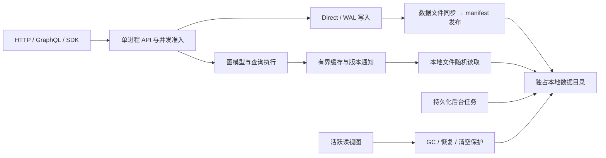

# GGraphDB 本地磁盘架构

本分支采用单机、单进程、多租户并发读写。图模型、JSON DSL、GraphQL、来源治理和运维功能
保持独立于存储介质，底层继续使用 Parquet 提交、快照、索引与可选 WAL。

## 写入

同一租户通过现有前台锁串行发布，不同租户并发处理。数据文件先落盘并同步，再原子发布
manifest；读端只读取已发布版本。索引按租户顺序更新，索引落后时维持既有 freshness/回退契约。
四线程、每组最多 64 个任务合并数据文件所在目录的 fsync，所有引用文件可持久恢复后才发布目录。

WAL 模式保留同步接管、分组发布、幂等和崩溃重放协议。202 与已提交版本仍然区分。

## 读取和回收

Parquet 基于文件句柄随机读取，支持列和行组筛选；现有解码准入与有界缓存继续限制内存。
图缓存由本地版本变化通知更新，无需远端轮询。恢复、删除和配置变化也触发失效，防止同版本旧缓存复用。
读视图覆盖一次 HTTP 读取，GC、清理提交、恢复和清空等待该租户活跃视图结束。

## 部署与数据格式

服务与离线 CLI 独占 `GRAPHDB_DATA_DIR`。在线维护使用 HTTP，目录不能与另一个实例或旧版本共享。
持久化布局仍为 `<prefix>/tenants/<tenant>/` 下的 manifest、commits、snapshots、indexes、config、tasks 等。
启动拒绝远端存储配置和 PostgreSQL 协调标记；无远端迁移、复制、选主或跨机器高可用协议。

运行参数、兼容性和验收矩阵见[本地磁盘指南](local-disk.zh-CN.md)。
