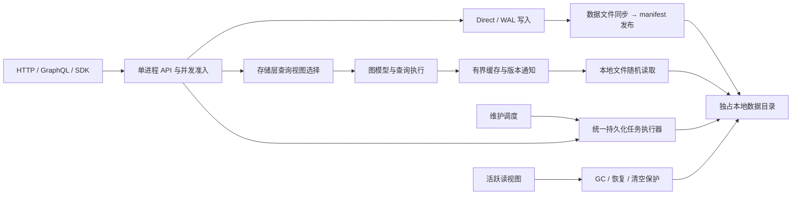

# GGraphDB 2.x 本地磁盘架构

[English](architecture.en.md)

主版本采用单机、单进程、多租户并发读写。图模型、JSON DSL、GraphQL、来源治理和运维功能
保持独立于存储介质，底层继续使用 Parquet 提交、快照、索引与可选 WAL。

```mermaid
flowchart LR
  Client[HTTP / GraphQL / SDK] --> API[单进程 API 与并发准入]
  API --> Read[存储层查询视图选择]
  Read --> Graph[图模型与查询执行]
  API --> Ingest[Direct / WAL 写入]
  Graph --> Cache[有界缓存与版本通知]
  Cache --> Files[本地文件随机读取]
  Ingest --> Publish[数据文件同步 → manifest 发布]
  Publish --> Disk[独占本地数据目录]
  Files --> Disk
  Maintenance[维护调度] --> Tasks[统一持久化任务执行器]
  API --> Tasks
  Tasks --> Disk
  Views[活跃读视图] --> GC[GC / 恢复 / 清空保护]
  GC --> Disk
```

## 写入

同一租户通过现有前台锁串行发布，不同租户并发处理。数据文件先落盘并同步，再原子发布
manifest；读端只读取已发布版本。索引按租户顺序更新，索引落后时维持既有 freshness/回退契约。
四个共享编码名额按文件数、16 MiB 和 50 ms 合作式预算分批发布，引用文件和目录全部同步后才发布 catalog。
实体、边、邻接目录和字段索引按 256 个分片写时复制；不超过 32 项的小集合使用紧凑 map，增长后再分片。逻辑内容使用增量分片 SHA-256，提交返回 `data_hash`。

WAL 模式保留同步接管、分组发布、幂等和崩溃重放协议。202 与已提交版本仍然区分。

## 读取和回收

Parquet 基于文件句柄随机读取，支持列和行组筛选；现有解码准入与有界缓存继续限制内存。
图缓存由本地版本变化通知更新，无需远端轮询。恢复、删除和配置变化也触发失效，防止同版本旧缓存复用。
读视图覆盖一次 HTTP 读取。GC 按读视图进入的代次延迟回收旧文件，新查询可以继续进入；
manifest/catalog 变化会使当批删除依据失效，同版本索引发布也受保护。回收标记有界，超限时保守
延迟删除。恢复、清空、显式恢复检查/提交清理仍使用租户排他保护。扫描完成时仍可能存在
`checkpoint.deferred_files`，维护调度会再次清理。读写缓存共用发布代次与不可变图，保留预算仍分别
管理；空闲淘汰保留，freshness 不再依赖周期轮询。

已持久化图的发布集中在 `TenantStore`。Direct、WAL、恢复与 compact 使用同一发布入口，
HTTP 和 WAL 启动代码不再各自推动读缓存更新。读缓存可以复用不可变图；写缓存是否保留该图
不影响本次读端发布。文件替换通知负责失效，包括恢复到较低版本或相同版本的情况。

普通和流式查询共用存储层的索引选择、版本约束与失败退避规则。一次请求内复用 manifest 和
catalog 查询结果，绑定具体 store 与租户。该复用不代替活跃读视图保护，调用者仍需持有读视图。

## 任务与本地协调

新建索引重建任务使用普通 `index_rebuild` 任务执行器，共用有界排队、取消、重试、进度和终态
持久化。索引接口保留原有响应结构；以前独立保存的索引任务记录仍可查询。索引定义变化可以
排入替代任务，旧任务的进度和结束不会覆盖替代任务。清理阶段按批次让出执行容量。

本地任务是否存活由进程内注册表判定，取消直接通知执行上下文。正常运行无需取消状态轮询或
GC 任务心跳。重启后没有执行者的活动记录会在查询/恢复检查中标记失败，可按已有 checkpoint
重试；这不等于自动重跑所有任务。WAL 仍使用自己的受理、发布和重放协议。

目录独占锁保证只有一个进程访问数据。持久化 writer 记录的 token/epoch 用于隔离租户代次，
本地路径不依赖租约到期或续租。条件写、内容校验和发布前后的代次检查仍保留，避免恢复、删除
或重建租户后旧任务继续写入。代次记录通过文件元数据验证缓存，减少重复 Parquet 解码。

运行时统一取消并等待普通任务、增量索引和维护循环退出，纳入 WAL 关闭并将错误返回服务/CLI。
最后才释放数据目录锁；后台工作退出超时则保留独占锁，后续可重试关闭。

## 备份自动化

维护循环调度持久化普通备份任务，支持重启续做、失败退避、完整下载校验、可选隔离恢复演练及
有界 S3 保留清理，复用现有任务执行器。配置和边界见[对象备份指南](object-backup.zh-CN.md)。

## 模块边界

| 模块 | 职责 |
| --- | --- |
| `internal/httpapi` | HTTP/GraphQL 协议、租户路由、请求准入、响应与追踪；认证授权由外部网关负责 |
| `internal/storage` | 持久化、租户代次、读视图与缓存发布、查询索引选择、任务生命周期 |
| `internal/maintenance` | 维护调度和决策，复用存储任务与预算，通过回调接入用量缓存及审计 |
| `internal/graph` / `internal/query` | 图结构、查询规划与执行 |
| `internal/backupstore` | 可选对象存储备份传输，不参与在线读写 |

文件存储直接使用本地随机读取与有界目录遍历；保留测试和观测所需的窄接口，移除无调用者的
单写入者包装层。维护调度不依赖 HTTP，可由同进程其他入口调用。

## 部署与数据格式

服务与离线 CLI 独占 `GRAPHDB_DATA_DIR`。在线维护使用 HTTP，目录不能与另一个实例或旧版本共享。
持久化布局仍为 `<prefix>/tenants/<tenant>/` 下的 manifest、commits、snapshots、indexes、config、tasks 等。
本次精简保持已发布 2.0 的 Parquet/WAL 格式及数据目录兼容性，不引入第二种元数据编码。
启动拒绝远端存储配置和 PostgreSQL 协调标记；无远端迁移、复制、选主或跨机器高可用协议。

运行参数、兼容性和验收矩阵见[本地磁盘指南](local-disk.zh-CN.md)。

2.1 沿用 2.0 数据格式；停止旧进程后可复用已有 2.0/2.1 目录。替换 1.x 时须使用新目录，
不提供 1.x 数据迁移或旧 MD5 契约，见[版本边界](naming-and-compatibility.zh-CN.md)。
