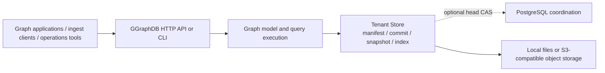

# GGraphDB Database Introduction

[中文](database-introduction.zh-CN.md)

GGraphDB is a lightweight, general-purpose Go current-state property knowledge
graph for entity-relationship data. It organizes entities and their
relationships as a graph and uses local files or S3-compatible object storage
as the persistence backend. Knowledge bases and CMDB are supported application
scenarios alongside asset relationships, service dependencies, topology,
lineage, and other graph-shaped workloads. It does not implement RDF/OWL,
SPARQL, ontology reasoning, or historical graph queries.

## Core capabilities

- **Graph data model**: use `Entity` for domain objects and directed `Edge`
  values for relationships such as dependencies, ownership, containment, or
  other application-defined links.
- **Tenant isolation**: each tenant uses an independent data prefix; data APIs
  select the tenant with `X-Tenant-ID`.
- **Flexible data shape**: entity fields can be schemaless or described by an
  optional `EntityType` (`CIType` in 1.0); labels classify entities, and
  optional relation property schemas validate/default edge fields.
- **Optional identity and source governance**: applications can use
  `IdentityKey` rules to reconcile duplicates, while source priority,
  confidence, and write time resolve field and relation conflicts.
- **Object-storage persistence**: manifests define visibility boundaries;
  immutable commits, Parquet snapshots, and rebuildable indexes persist data.
  Manifest CAS prevents stale writers from overwriting newer versions.
- **Read/write modes**: one binary supports `all`, `writer`, and `reader`.
  Local coordination uses one active writer per tenant; optional PostgreSQL
  head CAS supports 2–8 optimistic writers. Readers load immutable graph
  objects from object storage.
- **Query options**: GraphQL, JSON Query DSL, 1-8 step bounded pattern matching,
  indexed bidirectional traversal, streaming queries, current-state scans, and
  snapshot export.
- **Bulk import**: task-backed CSV and JSONL ingestion with checkpoints.

## What it is useful for

GGraphDB can serve as the data layer for general entity-relationship
applications, including CMDB and resource relationship graphs:

- model domain objects and typed relationships with flexible properties;
- traverse dependencies, ownership, containment, lineage, or other graph
  structures;
- calculate impact scope and shortest paths;
- accept direct writes or batches with idempotency and optional source
  reconciliation;
- provide a stable query interface to graph applications, including CMDB,
  asset, topology, and operations products.

## Data model

```text
Tenant
 ├── Entity       resource, such as host, service, or database
 ├── Edge         relationship, such as runs_on or depends_on
 ├── EntityType   optional entity type definition and identity rules
 ├── RelationType relationship type, direction, and cardinality
 └── RelationSchema optional edge property constraints and defaults
```

A small graph may look like:

```text
service:api ──runs_on──> host:app-01
service:api ──depends_on─> database:orders
```

Entity fields remain flexible:

```json
{
  "id": "host:app-01",
  "kind": "host",
  "labels": ["asset", "production"],
  "source": "agent",
  "external_id": "app-01",
  "fields": {
    "hostname": "app-01",
    "region": "ap-southeast-1"
  }
}
```

## Runtime and storage architecture



A write normally follows this path:

1. accept a direct commit or ingestion batch;
2. validate and reconcile entities, relations, identities, and source priority;
3. write an immutable commit and publish a new version through the manifest;
4. let readers load the snapshot and replay visible commits, using persisted
   indexes when available.

After sustained operation, compact folds the commit tail into a snapshot.
GC, repair, and index rebuild tasks keep data and indexes healthy.

## Quick start

Start the local service:

```sh
go run ./cmd/graphdb serve
```

Create a tenant:

```sh
go run ./cmd/graphdb create-tenant demo
```

Write example data:

```sh
go run ./cmd/graphdb commit demo examples/commit.json
```

Run a query:

```sh
go run ./cmd/graphdb query demo examples/query-match.json
```

Tenant-scoped HTTP requests require:

```http
X-Tenant-ID: demo
```

## Project layout

| Directory | Responsibility |
| --- | --- |
| `cmd/graphdb` | CLI commands and service startup |
| `internal/graph` | entities, relations, types, validation, reconciliation, and source governance |
| `internal/query` | GraphQL adapter, query DSL, planning, execution, traversal, and streaming |
| `internal/storage` | object storage, manifests, commits, snapshots, indexes, and ingestion metadata |
| `internal/httpapi` | HTTP routes, modes, rate limits, tenant routing, and operations APIs |
| `internal/config` | environment variables and runtime configuration |
| `sdk/go`, `sdk/python` | Go and Python SDKs |

## Current boundaries

- Local coordination supports one active writer per tenant. PostgreSQL
  coordination optionally supports 2–8 optimistic writers and does not provide
  cross-tenant transactions.
- Readers use manifests, snapshots, and commits from object storage. Use
  `min_version` for read-after-write consistency and `allow_stale` when
  eventual consistency is acceptable.
- Tenant selection for data APIs relies on `X-Tenant-ID`; production
  authentication and authorization belong at the gateway or upstream system.
- Reads expose the latest visible tenant graph and do not provide historical
  version queries.

## Related documentation

- [Quick Start](user/quickstart.md) · [中文](user/quickstart.zh-CN.md)
- [Data Model](user/data-model.md) · [中文](user/data-model.zh-CN.md)
- [Write And Ingest](user/write-ingest.md) · [中文](user/write-ingest.zh-CN.md)
- [Read And Query](user/read-query.md) · [中文](user/read-query.zh-CN.md)
- [Deployment And Operations](user/deploy-ops.md) · [中文](user/deploy-ops.zh-CN.md)
- [Architecture](architecture.md)
- [OpenAPI](openapi.yaml)
