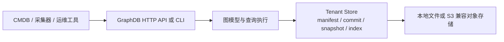

# GraphDB 数据库简介

[English](database-introduction.md)

GraphDB 是一个使用 Go 编写的轻量级图数据库，主要面向内部 CMDB 场景。它把实体和实体之间的关系组织成图，并使用本地文件或 S3 兼容对象存储作为持久化后端，支持多租户、采集写入、图查询和运维管理。

## 核心特点

- **图数据模型**：以 `Entity` 表示实体，以有向 `Edge` 表示关系，适合表达主机、服务、数据库及其依赖关系。
- **多租户隔离**：每个租户使用独立的数据前缀，数据 API 通过 `X-Tenant-ID` 选择租户。
- **灵活的数据结构**：实体字段可以无模式存储，也可以通过 `CIType` 定义字段类型、必填、默认值、唯一性和索引属性。
- **身份合并与数据治理**：支持 `IdentityKey` 自动识别重复实体，并按照来源优先级、置信度和写入时间处理字段及关系冲突。
- **对象存储持久化**：以 manifest 作为可见性边界，使用不可变提交、Parquet 快照和可重建索引保存数据；通过 manifest CAS 避免陈旧写入覆盖新版本。
- **读写模式分离**：同一个程序支持 `all`、`writer` 和 `reader` 三种运行模式；当前边界是每个租户一个活动写入者，读端从对象存储加载数据。
- **多种查询方式**：提供 JSON Query DSL、GQL、流式查询、当前态扫描和快照导出。

## 可以解决什么问题

GraphDB 适合用作 CMDB 或资源关系图的数据底座，例如：

- 查询某台主机上运行的服务；
- 查找服务、主机、数据库之间的依赖链路；
- 计算影响范围和最短路径；
- 接收多个采集器的批量数据并处理幂等、重复实体和冲突字段；
- 为上层 CMDB、资产管理、拓扑展示或运维分析系统提供统一查询接口。

## 数据模型

```text
Tenant
 ├── Entity       实体，例如 host、service、database
 ├── Edge         关系，例如 runs_on、depends_on、owned_by
 ├── CIType       实体类型定义和身份规则
 └── RelationType 关系类型、方向和基数定义
```

一个简单的图可以表示为：

```text
service:api ──runs_on──> host:app-01
service:api ──depends_on─> database:orders
```

实体字段可以保持灵活，例如：

```json
{
  "id": "host:app-01",
  "kind": "host",
  "source": "agent",
  "external_id": "app-01",
  "fields": {
    "hostname": "app-01",
    "region": "ap-southeast-1"
  }
}
```

## 运行和存储架构



写入通常经过以下流程：

1. 接收直接提交或采集批次；
2. 对实体、关系、身份和来源优先级进行校验与合并；
3. 写入不可变 commit，并通过 manifest 发布新版本；
4. 读端加载快照并回放可见提交，必要时使用持久化索引加速查询。

长时间运行后可以通过 compact 把提交尾部折叠为快照，并通过 GC、repair、index rebuild 等任务维护数据和索引。

## 快速开始

启动本地服务：

```sh
go run ./cmd/graphdb serve
```

创建租户：

```sh
go run ./cmd/graphdb create-tenant demo
```

写入示例数据：

```sh
go run ./cmd/graphdb commit demo examples/commit.json
```

执行查询：

```sh
go run ./cmd/graphdb query demo examples/query-match.json
```

HTTP API 的租户级请求需要携带：

```http
X-Tenant-ID: demo
```

## 项目结构

| 目录 | 职责 |
| --- | --- |
| `cmd/graphdb` | CLI 命令和服务启动入口 |
| `internal/graph` | 实体、关系、类型、校验、合并和来源治理 |
| `internal/query` | 查询 DSL、GQL、规划、执行、遍历和流式查询 |
| `internal/storage` | 对象存储、manifest、commit、快照、索引和采集元数据 |
| `internal/httpapi` | HTTP 路由、读写模式、限流、租户和运维接口 |
| `internal/config` | 环境变量和运行配置 |
| `sdk/go`、`sdk/python` | Go 和 Python SDK |

## 当前边界

- 每个租户当前只支持一个活动写入者；writer lease 和 manifest CAS 用于防止陈旧或重复写入，不是分布式事务协调器。
- 读端以对象存储中的 manifest、快照和提交为准；需要读后写一致性时，可以使用 `min_version`，允许最终一致读取时可以使用 `allow_stale`。
- 数据 API 的租户选择依赖 `X-Tenant-ID`；实际部署时应由网关或上游系统提供认证与授权。
- 当前读取的是租户的最新可见图状态，不提供历史版本查询。

## 相关文档

- [快速开始](user/quickstart.md)
- [数据模型](user/data-model.md)
- [写入与采集](user/write-ingest.md)
- [读取与查询](user/read-query.md)
- [部署与运维](user/deploy-ops.md)
- [整体架构](architecture.md)
- [OpenAPI](openapi.yaml)
