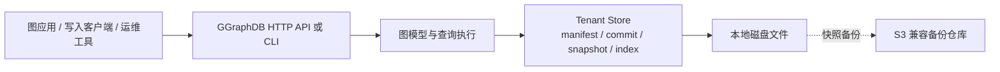

# GGraphDB 数据库简介

[English](database-introduction.md)

GGraphDB 是一个使用 Go 编写的轻量级通用当前态属性知识图谱，面向实体关系
数据。它把实体和关系组织成图，并使用本地磁盘文件持久化。
知识库和 CMDB 都是支持的应用场景，也可用于资产关系、服务依赖、IT 拓扑、
数据血缘等图结构数据。它不实现 RDF/OWL、SPARQL、本体推理或历史图查询。

## 核心特点

- **图数据模型**：以 `Entity` 表示领域对象，以有向 `Edge` 表示关系，关系类型和字段由应用定义。
- **多租户隔离**：每个租户使用独立的数据前缀，数据 API 通过 `X-Tenant-ID` 选择租户。
- **灵活的数据结构**：实体字段可保持无模式，也可使用可选 `EntityType`
  （1.0 名称为 `CIType`）；标签用于分类实体，关系属性 schema 用于校验和
  填充边字段。
- **可选身份合并与来源治理**：应用可以使用 `IdentityKey` 自动识别重复实体，并按来源优先级、置信度和写入时间处理字段及关系冲突。
- **本地持久化**：一个进程独占数据目录，数据文件同步完成后再发布 manifest；支持 direct 和同步 WAL。
- **在线读写**：`all` 模式服务多租户并发请求，读视图固定不可变版本，查询可以指定 `min_version`。
- **恢复边界**：可选 S3 兼容快照备份与按需恢复；不依赖 PostgreSQL，不提供多 writer、复制或自动故障切换。
- **多种查询方式**：提供 GraphQL、JSON Query DSL、1-8 步有界 pattern、索引化
  双向遍历、流式查询、当前态扫描和快照导出。
- **批量导入**：task 驱动、带 checkpoint 的 CSV 和 JSONL ingest。

## 可以解决什么问题

GGraphDB 适合用作通用实体关系应用的数据底座，CMDB 和资源关系图只是其中的典型场景，例如：

- 建模带有灵活属性的领域对象和类型化关系；
- 查询依赖、所有权、包含、血缘或其他多跳关系；
- 计算影响范围和最短路径；
- 接收直接写入或批量数据，并按需处理幂等、身份合并和冲突字段；
- 为图应用提供统一查询接口，包括 CMDB、资产管理、拓扑展示和运维分析系统。

## 数据模型

```text
Tenant
 ├── Entity       实体，例如 host、service、database
 ├── Edge         关系，例如 runs_on、depends_on、owned_by
 ├── EntityType   可选实体类型定义和身份规则
 ├── RelationType 关系类型、方向和基数定义
 └── RelationSchema 可选边属性约束和默认值
```

一个简单的图可以表示为：

```text
service:api ──runs_on──> host:app-01
service:api ──depends_on─> database:orders
```

实体字段可以保持灵活，例如：

```json
{
  "id": "host:app-01",
  "kind": "host",
  "labels": ["asset", "production"],
  "source": "agent",
  "external_id": "app-01",
  "fields": {
    "hostname": "app-01",
    "region": "ap-southeast-1"
  }
}
```

## 运行和存储架构


```mermaid
flowchart LR
  Client["图应用 / 写入客户端 / 运维工具"] --> API["GGraphDB HTTP API 或 CLI"]
  API --> Graph["图模型与查询执行"]
  Graph --> Store["Tenant Store\nmanifest / commit / snapshot / index"]
  Store --> Object["本地磁盘文件"]
  Object -. 快照备份 .-> S3["S3 兼容备份仓库"]
```

写入通常经过以下流程：

1. 接收直接提交或采集批次；同步 WAL 先完成校验与 fsync；
2. 校验并合并实体、关系、身份与来源优先级；
3. 写入并同步不可变文件，再替换 manifest；
4. 发布进程内可见版本并更新派生索引。

长时间运行后可以通过 compact 把提交尾部折叠为快照，并通过 GC、repair、index rebuild 等任务维护数据和索引。

## 快速开始

启动本地服务：

```sh
go run ./cmd/graphdb serve
```

创建租户：

```sh
go run ./cmd/graphdb create-tenant demo
```

写入示例数据：

```sh
go run ./cmd/graphdb commit demo examples/commit.json
```

执行查询：

```sh
go run ./cmd/graphdb query demo examples/query-match.json
```

HTTP API 的租户级请求需要携带：

```http
X-Tenant-ID: demo
```

## 项目结构

| 目录 | 职责 |
| --- | --- |
| `cmd/graphdb` | CLI 命令和服务启动入口 |
| `internal/graph` | 实体、关系、类型、校验、合并和来源治理 |
| `internal/query` | GraphQL adapter、查询 DSL、规划、执行、遍历和流式查询 |
| `internal/storage` | 本地文件存储、manifest、commit、快照、索引和采集元数据 |
| `internal/httpapi` | HTTP 路由、读写模式、限流、租户和运维接口 |
| `internal/config` | 环境变量和运行配置 |
| `sdk/go`、`sdk/python` | Go 和 Python SDK |

## 当前边界

- 一个进程独占目录，不提供分布式 writer、跨租户事务、复制或自动故障切换。
- 已有 2.0/2.1 目录可在停止旧进程后沿用；替换 1.x 须使用新目录，不提供 1.x 迁移或跨主版本回滚。
- 同步 WAL 的 durable `202` 表示已受理，不代表版本已发布。WAL 覆盖磁盘可恢复的进程故障，备份支持恢复到另一块磁盘。
- 使用 `min_version` 保证写后读，只有业务允许旧读时才开启 `allow_stale`。
- 数据 API 的租户选择依赖 `X-Tenant-ID`；实际部署时应由网关或上游系统提供认证与授权。
- 当前读取的是租户的最新可见图状态，不提供历史版本查询。

## 相关文档

- [快速开始](user/quickstart.zh-CN.md)
- [数据模型](user/data-model.zh-CN.md)
- [写入与采集](user/write-ingest.zh-CN.md)
- [读取与查询](user/read-query.zh-CN.md)
- [部署与运维](user/deploy-ops.zh-CN.md)
- [整体架构](architecture.md)
- [OpenAPI](openapi.yaml)
