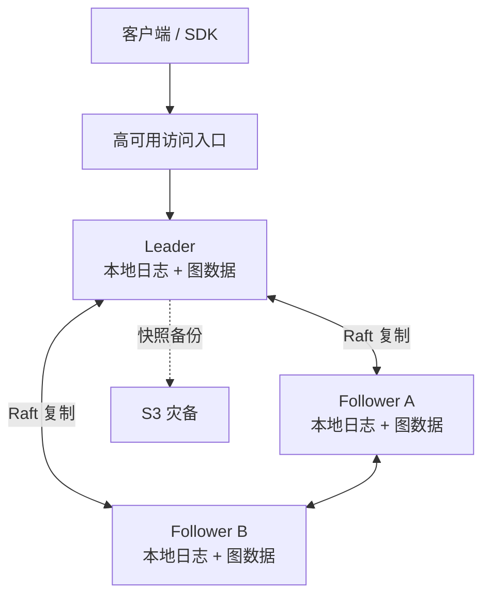

# GraphDB 高可用版本设计方案

- 状态：设计基线。2026-10-01 已在独立 `codex/raft-ha` 分支实现首版；运行范围与限制见 [运行说明](raft-ha.zh-CN.md)，已完成和待完成的验证见 [验收记录](raft-ha-validation.zh-CN.md)。
- 日期：2026-09-28。
- 基础版本：GraphDB 2.0 本地盘版。
- 代码核对基线：`7171330caa38ec2c953cc11c3f7cae0beec691fb`。

## 设计结论与前提

采用**三个完整数据副本、单主写入、Raft 同步复制、本地盘存储、S3 灾备**的架构。
延续 2.0 的本地读写路径，在一台机器故障时自动切换。

本方案按以下前提设计：

- 同地域部署，三个节点位于独立故障域。
- 每台机器能够容纳完整数据。
- 写入允许承担多数派同步复制的延迟成本。
- 正常读写和自动切换不依赖 S3；S3 用于备份恢复。

## 1. 整体架构

- 三个节点各自拥有独立磁盘和数据目录。
- 所有写入由当前 Leader 排序，多数副本持久化后确认。
- 首版由 Leader 提供在线查询，Follower 持续应用数据，保持可接管状态。
- 访问入口也需要高可用，或者 SDK 支持多个节点地址。
- S3 继续承担备份恢复，正常读写和自动切换不依赖 S3。

三个投票节点能在一个节点故障后保留多数派；失去多数派时停止写入。
这是 Raft 的基本可用性边界，参见 [Raft 论文](https://raft.github.io/raft.pdf)。

**首版采用一个 Raft 组管理整个实例。** 后续需要扩展写入容量时，再按租户集合拆组，
每个租户仍由一个组完整管理。

## 2. 写入成功的语义

目前 2.0 的 WAL 受理和图版本发布都只在本机持久化。HA 版本需要保留它们的区别，
同时升级持久化保证：

| 返回结果 | HA 版本应保证 |
| --- | --- |
| WAL `202 accepted` | 请求内容和幂等身份已在多数副本持久化；换主后继续处理 |
| direct 成功 / WAL `committed` | 提交决策已获多数派确认，Leader 已完成本地图版本发布，数据可查询 |
| 请求超时或连接断开 | 结果可能已经提交；客户端通过幂等键重试或查询状态 |

WAL 模式保留两个明确阶段：

1. **受理请求**：复制请求及身份，确认后返回 `202`。
2. **发布提交**：Leader 决定合批内容、提交顺序和版本，通过复制日志确认，再应用到图。

**合批边界必须进入复制日志。** 各节点不能自行按照本地定时器合批，否则版本号、
幂等结果和摘要可能不一致。

HA 模式由复制日志统一承担这些持久化职责。现有 WAL 的编码、同步写入和恢复经验可以复用，
但需要明确唯一的恢复依据。

## 3. 复制逻辑变更，本地生成存储文件

正常写入复制规范化的提交内容，包括：

- 租户及其代次、请求身份、幂等信息。
- 实体、边、schema、来源策略等变更。
- 提交 ID、时间戳，以及确定的合批和版本规则。
- 租户创建、删除、恢复，以及影响业务语义的任务状态。

各节点根据相同日志，在本地生成 Parquet、manifest 和索引。

### 3.1 确定性执行

当前提交路径会生成随机提交 ID、读取当前时间，见
[tenant_commit.go](../internal/storage/tenant_commit.go)。

HA 中这些值由 Leader 确定并写入日志；Follower 应用日志时使用相同值。
`expected_version` 也必须在有序应用阶段复核。

### 3.2 发布与重放保持一致

图版本、幂等结果和已应用日志位置必须形成可恢复的一致检查点。

如果数据发布成功后进程崩溃，重放只能完成该次提交，不能再增加一次版本。
磁盘错误则让该节点退出就绪状态，不能跳过失败记录继续应用。

### 3.3 所有业务变更都经过复制入口

租户删除、恢复、来源清理、schema 修改等必须遵循同一顺序。
离线 CLI 在 HA 模式下也必须走集群管理接口，避免绕过复制直接修改某个副本。

## 4. 查询与故障切换的语义

首版默认提供**强一致读取**：

1. Leader 通过 `ReadIndex` 确认自己仍拥有多数派支持。
2. 等待本地应用到对应日志位置。
3. 固定读视图，执行查询。

仅把请求发到“自认为是 Leader”的节点并不足够，网络隔离后的旧主可能返回过期数据。
`etcd/raft` 提供了相应的读取屏障机制，参见
[etcd/raft 文档](https://github.com/etcd-io/raft)。

现有接口需要以下处理：

- **`min_version`**：副本不足时等待或转发，超时明确报错。
- **恢复后的版本**：读取令牌同时包含租户代次，避免恢复到旧版本后误认数据。
- **分页游标**：当前包含本地索引 `CatalogHash`，不能默认在另一个节点继续使用，见
  [scan.go](../internal/storage/scan.go)。需要绑定逻辑读版本及稳定排序位置；接管节点无法
  保留该读视图时，明确返回游标过期。

Follower 分担读流量可以后续增加，并区分强一致读取和允许延迟的读取。

## 5. 快照、恢复和后台维护

### 5.1 增加专门的复制快照

现有 [TenantBackupRecord](../internal/storage/tenant_backup.go) 保存图数据及租户配置，
但不能直接充当完整的 Raft 恢复快照。

复制快照还必须包含：

- 日志位置及成员配置。
- 租户代次、逻辑版本。
- 已受理但尚未完成的请求。
- 幂等结果和必要的任务状态。

落后节点通过“安装快照，再重放后续日志”追赶。安装必须可校验、可取消、可崩溃恢复；
完成前不对外提供正常服务。

### 5.2 租户恢复作为集群操作

从 S3 恢复时，先下载、校验并在足够副本上持久保存恢复内容，再通过复制日志发布新的租户代次。
不能只记录一个 S3 地址便确认恢复成功。

### 5.3 维护尽量在各节点独立执行

索引、压实和文件 GC 属于本地存储维护，可以独立调度，但必须保护查询、快照传输和日志追赶
所需的文件。

影响图内容的清理操作仍经过复制日志。备份上传等外部操作使用稳定任务 ID，切主后能够幂等恢复。

## 6. 性能设计的重点

**HA 会增加网络等待、日志写入和副本资源成本，不会自动消除目前的维护长尾。**

优先保证：

- Raft 心跳、日志持久化与 Parquet 编码、GC 使用独立的执行队列和资源预算。
- 复制采用有界批量、流控和同步落盘合并。
- 同租户应用保序，租户间可以并行；读取屏障只能推进到连续完成的位置。
- 慢副本超过追赶预算后改用快照，避免无限保留日志。
- 接管节点的应用积压必须受控。

故障切换时间实际由以下部分组成：

> 选主时间 + 新主应用追赶时间 + 客户端发现与重试时间

当前维护仍存在秒级写入长尾，因此“秒级切换”需要故障注入实测，不能根据选举超时直接承诺。

## 7. 实施顺序和验收

嵌入成熟的 `etcd/raft` 库，由 GraphDB 实现传输、日志持久化、快照和状态应用。
该库本身不替应用完成这些部分，参见
[实现职责说明](https://github.com/etcd-io/raft/blob/main/README.md)。

### 7.1 实施顺序

1. **统一提交入口**：确定性提交、受理/发布状态机、幂等重放及恢复检查点。
2. **实现三副本 HA**：选主、复制、强一致读取、快照追赶、安全替换节点、滚动升级。
3. **优化容量与读取**：受控副本读、按租户集合拆组；有需要时增加日志归档和时间点恢复。

### 7.2 故障验收

| 场景 | 预期行为 |
| --- | --- |
| 任意一个节点宕机 | 剩余两个节点继续服务或完成自动接管 |
| 网络分成 2＋1 | 多数派继续；少数派不确认写入、不提供强一致读 |
| 写入确认后主机损坏 | 已确认提交保留，已受理请求可恢复处理 |
| 丢失两个节点 | 停止写入，进入明确的恢复流程 |
| 提交成功但响应丢失 | 幂等重试得到原结果，版本不重复增长 |
| 维护、快照安装期间崩溃 | 重启后状态一致，追赶所需文件未被提前回收 |

## 首版交付边界

先完成**三副本、单主、强一致、自动接管**这一版，保持当前图引擎的主体结构，
确保已确认数据不丢、切换后状态一致。

Follower 分担读流量、按租户集合拆组和时间点恢复属于后续阶段。
本文件记录设计方案，不表示当前 2.0 已具备上述高可用能力。
