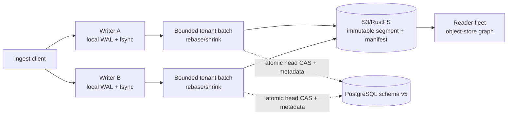

# PostgreSQL-CAS Multi-Writer Ingest WAL (1.3)

[中文](ingest-wal-multiwriter-design.zh-CN.md)

## Status and scope

This document is the GGraphDB 1.3 implementation contract. It is
release-gated: the contract and rollout rules are defined here, but this
document does not claim that the current branch has passed the required
integration, crash-recovery, or capacity evidence.

The WAL applies only to `POST /v1/ingest/batches`. Direct commits, schema
mutations, tenant lifecycle operations, and maintenance tasks keep their
existing paths and fencing rules.

## Contract

| Concern | 1.3 rule |
| --- | --- |
| WAL ownership | Every writer has an independent segmented WAL on its own persistent volume. A WAL volume is not shared by writers. |
| Durability | A durable acknowledgement covers process failure while the original writer volume can be recovered. Permanent loss of that volume is outside this guarantee. |
| Graph authority | Immutable graph objects and the published object-store manifest remain the graph-data source of truth. PostgreSQL is coordination state, not a graph or WAL store. |
| PostgreSQL contents | Tenant head/generation, idempotency reservations/results, collector state, and batch coordination metadata only. Payloads, WAL records, commit segments, and graph data stay out of PostgreSQL. |
| Ordering | A writer preserves its local WAL LSN/FIFO order. Across writers, the order is the successful PostgreSQL head-CAS order; there is no global HTTP-arrival FIFO. |
| Accepted response | `202 Accepted` means that the writer durably took responsibility for the request. It is not a synchronous commit result. |
| Retry behavior | CAS, PostgreSQL, and temporary object-store failures are retried with rebase, backoff, and bounded batch shrinking. An accepted request is not failed because a retry budget was exhausted. |
| Terminal failures | Deterministic request, semantic, or lifecycle fencing errors may become `failed` and must be visible in the final batch result. |
| Owner routing | A stable `GRAPHDB_INSTANCE_ID` identifies the WAL owner. The returned status URL must route to that writer, including while its WAL is recovering. |
| Supported topology | Two to eight writers may concurrently receive the same tenant. The scaling objective is across tenants, not linear speed-up for one hot tenant. |
| Upgrade | A 1.2 direct writer and a 1.3 WAL writer may coexist through the same v5 PostgreSQL coordination contract during a controlled rollout. |

## Data and coordination flow



The WAL admission path performs static validation, appends the complete
request, and waits for `fsync` before returning `202`. It does not require a
successful PostgreSQL round trip. A writer may continue accepting requests
during a temporary PostgreSQL outage until its bounded WAL high-water policy
requires `429` or `503` before another record is accepted.

Each writer batches requests per tenant. A flush reads the latest head and
write context, applies requests in local WAL order, writes immutable candidate
objects, and commits one PostgreSQL transaction. That transaction must CAS the
tenant head and complete all idempotency results, collector updates, legacy
mirror outbox work, and derived-task metadata belonging to that batch.

## HTTP acknowledgement and status

The 1.3 WAL response has the existing batch identity plus the owner identity:

```json
{
  "batch_id": "aws-batch-001",
  "state": "accepted",
  "durability": "durable",
  "accepted_at": "2026-08-31T10:00:00Z",
  "estimated_flush_at": "2026-08-31T10:00:10Z",
  "writer_id": "writer-a",
  "status_url": "/v1/ingest/writers/writer-a/aws/collector-a/aws-batch-001"
}
```

`Location` and `status_url` identify the owner-routed batch status resource.
The 1.3 path is
`/v1/ingest/writers/{writer_id}/{source}/{collector_id}/{batch_id}`. The
gateway or service router must use `writer_id` to send that request to the
writer owning the WAL. Do not randomly load-balance an owner status request.
The legacy path `/v1/ingest/batches/{source}/{collector_id}/{batch_id}` remains
available for compatibility.

Clients that need to wait on the final result may send:

```http
Prefer: wait=committed
```

The status response may report `accepted`, `prepared`, `retrying`, `published`,
`committed`, or `failed`. During writer startup recovery it reports
`recovery_pending: true` rather than treating an owned durable record as a
404. A client retry of the same source page must keep the same `batch_id` and
`idempotency_key`.

## Publish protocol

1. Validate the request without depending on PostgreSQL, append the complete
   payload to the writer-local WAL, and `fsync` the record.
2. Return `202` with `durability=durable`, a stable `writer_id`, and the
   owner-routed status location.
3. Form a bounded batch for one tenant in local WAL order. A local FIFO barrier
   prevents later records from passing an unresolved earlier record.
4. Read the latest PostgreSQL head and immutable object-store write context.
   Build ordered logical commits and their deterministic idempotency results.
5. Persist a WAL `PREPARED` attempt containing the base revision/generation,
   immutable write context, per-request commit/results, final head/version, and
   `DataMD5`; use these inputs to deterministically rebuild candidate objects
   rather than persisting candidate object keys/hashes directly.
6. Write the immutable commit segment and candidate manifest to object storage.
7. In one PostgreSQL transaction, perform the head CAS and atomically finish
   all idempotency reservations, collector updates, and coordination metadata
   for the batch.
8. After the PostgreSQL CAS succeeds, finalize the required ingest batch record.
   Then append `PUBLISHED` and the terminal `FINALIZED` or `FAILED` state to the
   WAL. Derived indexes, materialized collector views, traces, and metrics may
   repair asynchronously and must not keep a safely finalized WAL record
   forever.

An ordinary CAS loss is not corruption. The next attempt reloads the new head
and rebases the batch. Repeated conflicts halve the publish prefix until a
single request remains, with exponential backoff and jitter. Candidate
objects that lose the race remain invisible and are eligible for safe,
post-grace-period garbage collection.

## Failure and lifecycle rules

- A PostgreSQL or object-store outage keeps an accepted record pending and
  retryable. It does not silently switch to local coordination.
- A WAL writer may start degraded when PostgreSQL or the coordination-marker
  object-store probe returns a transient unavailable/timeout error. It first
  restores the local owner identity and WAL, then may serve owner status and
  durable `202` admission while the dependency is unreachable. A missing or
  mismatched required schema or coordination marker is semantic and must fail
  closed at startup.
- WAL capacity, pending age, and reserved state-record space are hard bounds.
  Once the high-water policy is reached, reject new admission before writing
  another accepted payload; continue serving owner status and recovery.
- `PREPARED` recovery distinguishes a normal stale CAS attempt from an
  ambiguous transaction. Head identity plus durable idempotency results decide
  whether to rebase, finalize, or repair.
- Freeze, delete, or restore fencing wins over unpublished WAL. Such records
  may finish as lifecycle failures. A version that already passed head CAS is
  never rolled back by a later lifecycle operation.
- The original local WAL volume and stable instance identity must return
  together after a process restart. If the volume is permanently lost, 1.3
  does not claim that a previously acknowledged request can be recovered.

## Configuration and deployment

The coordinated WAL profile requires generic S3-compatible object storage,
PostgreSQL coordination, CAS writer topology, and a stable instance identity:

```ini
GRAPHDB_MODE=writer
GRAPHDB_STORAGE=s3
S3_PROVIDER=generic-s3
GRAPHDB_COORDINATION=postgres
GRAPHDB_WRITER_TOPOLOGY=cas
GRAPHDB_POSTGRES_DSN=postgres://<user>:<password>@<host>:5432/<db>
GRAPHDB_POSTGRES_SCHEMA=graphdb_coordination
GRAPHDB_COORDINATOR_NAMESPACE=<stable-cluster-id>
GRAPHDB_INSTANCE_ID=<stable-writer-id>
GRAPHDB_INGEST_MODE=wal
GRAPHDB_INGEST_WAL_DIR=/var/lib/graphdb/wal/ingest
GRAPHDB_INGEST_WAL_DURABILITY=sync
```

Give each writer its own persistent read-write volume and a unique
`GRAPHDB_INSTANCE_ID`. Never mount one WAL directory into two writers. A
rolling upgrade first brings the 1.3 binary up in direct mode, validates the
v5 coordination plane, and then enables WAL per writer. Before downgrading a
writer, stop new WAL admission, wait for its local WAL to finalize, and only
then return it to direct mode. A pending WAL is a downgrade blocker.

## Release evidence

Before this profile is described as released, the acceptance matrix must cover
2, 4, and 8 same-tenant writers; cross-writer duplicate identities; CAS
rebase/shrink; PostgreSQL outage and WAL high-water admission; crash points
from `ACCEPTED` through `FINALIZED`; lifecycle fencing; owner routing and
`recovery_pending`; and mixed 1.2 direct/1.3 WAL operation. No performance
number is implied until those runs produce commit-bound evidence.
