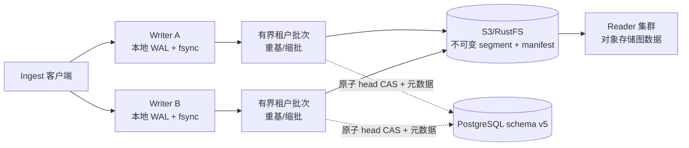

# PostgreSQL-CAS 多 writer Ingest WAL（1.3）

[English](ingest-wal-multiwriter-design.md)

## 状态与范围

本文是 GGraphDB 1.3 的实现合同。该合同仍受发行门禁约束：本文定义目标
合同和上线规则，但不宣称当前分支已经通过集成、崩溃恢复或容量证据。

WAL 只覆盖 `POST /v1/ingest/batches`。直接 commit、schema mutation、租户
生命周期操作和维护任务继续使用现有写入路径与 fencing 规则。

## 已冻结合同

| 范畴 | 1.3 规则 |
| --- | --- |
| WAL 所有权 | 每个 writer 在自己的持久卷上拥有独立的分段 WAL；不同 writer 不共享 WAL 卷。 |
| 持久性 | durable 确认只覆盖原 writer 进程故障，前提是原持久卷能够恢复；持久卷永久丢失不在保证内。 |
| 图数据权威 | 不可变图对象和对象存储中已发布的 manifest 仍是图数据真源。PostgreSQL 只保存协调状态，不是图或 WAL 存储。 |
| PostgreSQL 内容 | 只保存 tenant head/generation、幂等 reservation/result、collector 状态和批次协调元数据；payload、WAL record、commit segment 和图数据不写入 PG。 |
| 顺序 | 单 writer 内按 WAL LSN/FIFO；跨 writer 按成功的 PostgreSQL head CAS 顺序，不提供全局 HTTP 到达 FIFO。 |
| 已接收响应 | `202 Accepted` 表示 writer 已经持久接管请求，不是同步提交结果。 |
| 重试 | CAS、PostgreSQL 和对象存储暂时故障使用重基、退避和有界缩批重试；已接收请求不能因为重试预算耗尽而失败。 |
| 终态失败 | 确定性的请求、语义或生命周期 fencing 错误可以进入 `failed`，并必须在最终 batch result 中可见。 |
| owner 路由 | 稳定的 `GRAPHDB_INSTANCE_ID` 标识 WAL owner。状态 URL 必须路由回该 writer，包括该 writer 正在恢复 WAL 时。 |
| 支持拓扑 | 同一租户允许 2–8 个 writer 并发接收；扩展目标是跨租户，而不是单热点租户线性提速。 |
| 升级 | 1.2 direct writer 与 1.3 WAL writer 可在同一个 v5 PostgreSQL 协调合同上受控滚动混跑。 |

## 数据与协调流



WAL 准入先做静态校验，写入完整请求并等待 `fsync`，再返回 `202`；不要求
先完成 PostgreSQL 往返。PostgreSQL 暂时不可用时，writer 可以继续接收，直到
本地有界 WAL 高水位要求在写入下一条记录前返回 `429` 或 `503`。

每个 writer 按租户攒批。flush 读取最新 head 和 write context，按本地 WAL
顺序应用请求，把不可变候选对象写入对象存储，然后执行一个 PostgreSQL 事务。
该事务必须同时 CAS tenant head，并完成该批次的所有幂等结果、collector 更新、
legacy mirror outbox 和派生任务元数据。

## HTTP 确认与状态

1.3 WAL 响应在既有 batch 身份上增加 owner 身份：

```json
{
  "batch_id": "aws-batch-001",
  "state": "accepted",
  "durability": "durable",
  "accepted_at": "2026-08-31T10:00:00Z",
  "estimated_flush_at": "2026-08-31T10:00:10Z",
  "writer_id": "writer-a",
  "status_url": "/v1/ingest/writers/writer-a/aws/collector-a/aws-batch-001"
}
```

`Location` 和 `status_url` 指向 owner-routed batch status 资源。1.3 路径为
`/v1/ingest/writers/{writer_id}/{source}/{collector_id}/{batch_id}`。网关或服务
路由必须使用 `writer_id` 把查询发给拥有该 WAL 的 writer，不能随机负载均衡 owner
status 请求。旧路径 `/v1/ingest/batches/{source}/{collector_id}/{batch_id}` 继续
保留以兼容已有客户端。

需要等待最终结果时可发送：

```http
Prefer: wait=committed
```

状态可以是 `accepted`、`prepared`、`retrying`、`published`、`committed` 或
`failed`。writer 启动恢复期间应返回 `recovery_pending: true`，不能把已经持久接管
的记录错误当成 404。客户端重试同一源页面时必须复用相同的 `batch_id` 和
`idempotency_key`。

## 发布协议

1. 不依赖 PostgreSQL 完成请求静态校验，把完整 payload 写入 writer 本地 WAL 并
   `fsync`。
2. 返回 `durability=durable`、稳定 `writer_id` 和 owner-routed status location
   的 `202`。
3. 按一个租户的本地 WAL 顺序形成有界批次；未解决的前序记录形成 FIFO barrier，
   后续记录不能越过它。
4. 读取 PostgreSQL 最新 head 和对象存储不可变 write context，生成有序 logical
   commits 与确定性的幂等结果。
5. 把 base revision/generation、write-context、每请求 commit/result、最终
   head/version 和 `DataMD5` 写入持久化的 `PREPARED` attempt；这些输入用于
   确定性重建候选对象，不直接持久化 candidate object key/hash。
6. 将不可变 commit segment 和候选 manifest 写入对象存储。
7. 在同一个 PostgreSQL 事务中完成 head CAS，并原子结束该批次的所有幂等
   reservation、collector 更新和协调元数据。
8. PostgreSQL CAS 成功后先完成必需的 ingest batch record；随后向 WAL 追加
   `PUBLISHED`，并追加终态 `FINALIZED` 或 `FAILED`。派生索引、物化 collector
   view、trace 和 metrics 可以异步修复，不能永久阻止安全完成的 WAL 回收。

普通 CAS 失败不是损坏。下一次 attempt 重新加载新 head 并重基；持续冲突时把发布
前缀折半，最终退化到单请求，并使用指数退避和抖动。落败的候选对象保持不可见，
经过安全宽限期后可由 GC 回收。

## 故障与生命周期规则

- PostgreSQL 或对象存储暂时故障时，已接收记录保持 pending、可重试，不会静默切换
  到 local coordination。
- 如果 PostgreSQL 或对象存储 coordination marker 探测仅返回暂时不可用/超时，
  WAL writer 可以 degraded 启动；先恢复本地 owner 身份和 WAL，再在依赖不可达
  期间提供 owner status 和 durable `202` 准入。required schema 或 coordination
  marker 缺失/不匹配属于语义错误，启动必须 fail closed。
- WAL 容量、pending age 和为状态记录预留的空间都是硬边界。达到高水位后，在写入
  下一条 accepted payload 前拒绝新准入；owner status 和恢复仍须可用。
- `PREPARED` 恢复要区分普通的过时 CAS attempt 与模糊事务。通过 head identity 和
  持久幂等结果决定重基、收尾或 repair。
- freeze、delete、restore fencing 优先于未发布 WAL；相关记录可以最终成为生命周期
  失败。已经通过 head CAS 的 version 不会被后续生命周期操作回滚。
- 进程重启后必须以相同稳定实例身份重新挂载原 WAL 卷。若该卷永久丢失，1.3 不
  承诺恢复此前已经确认的请求。

## 配置与部署

协调 WAL profile 要求 generic S3 兼容对象存储、PostgreSQL 协调、CAS writer 拓扑
和稳定实例身份：

```ini
GRAPHDB_MODE=writer
GRAPHDB_STORAGE=s3
S3_PROVIDER=generic-s3
GRAPHDB_COORDINATION=postgres
GRAPHDB_WRITER_TOPOLOGY=cas
GRAPHDB_POSTGRES_DSN=postgres://<user>:<password>@<host>:5432/<db>
GRAPHDB_POSTGRES_SCHEMA=graphdb_coordination
GRAPHDB_COORDINATOR_NAMESPACE=<stable-cluster-id>
GRAPHDB_INSTANCE_ID=<stable-writer-id>
GRAPHDB_INGEST_MODE=wal
GRAPHDB_INGEST_WAL_DIR=/var/lib/graphdb/wal/ingest
GRAPHDB_INGEST_WAL_DURABILITY=sync
```

每个 writer 使用独立的持久读写卷和唯一的 `GRAPHDB_INSTANCE_ID`；绝不能把一个
WAL 目录挂载给两个 writer。滚动升级先用 direct 模式启动 1.3 二进制，验证 v5
协调平面，再逐个 writer 启用 WAL。降级前必须停止新 WAL 准入，等待该 writer 的
本地 WAL 全部 finalized，再切回 direct；存在 pending WAL 时禁止降级。

## 发行证据

在该 profile 宣布为正式发行能力前，验收矩阵必须覆盖同租户 2、4、8 writer，跨
writer 相同幂等身份，CAS 重基/缩批，PostgreSQL 故障与 WAL 高水位准入，从
`ACCEPTED` 到 `FINALIZED` 的崩溃切点，生命周期 fencing，owner 路由与
`recovery_pending`，以及 1.2 direct/1.3 WAL 混跑。没有 commit-bound 运行证据前，
不暗示任何性能数字。
