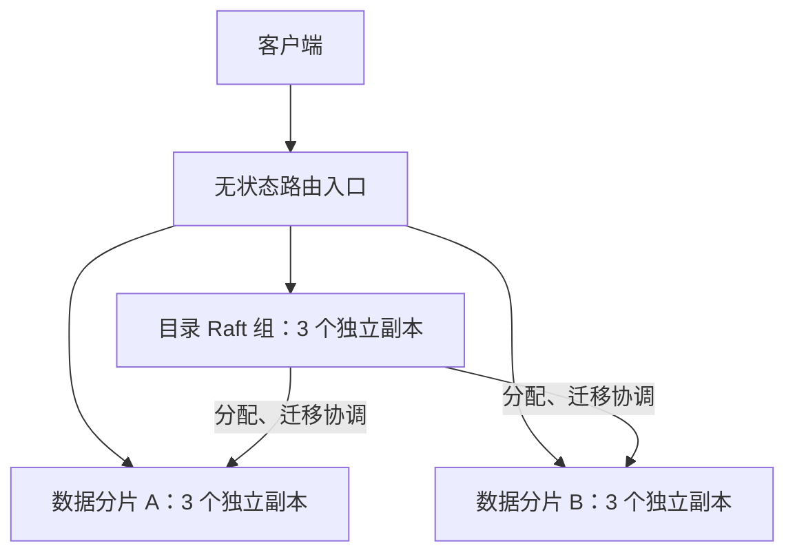

# 租户分片与扩容

分片模式使用独立的 Raft 数据组承载不同租户，保留默认单机和原有单组 Raft 部署。每个租户的完整图、版本、接入身份和维护记录都归一个组管理。新增组可以增加多个租户的存储和写入容量；单个租户仍由一个 Leader 服务，没有单租户图切分或跨分片关联查询。

## 拓扑与一致性



目录持久化分片地址、租户位置、路由代次和迁移阶段。入口缓存强一致查询所得的 active 位置，正常有效期 5 秒，最多 4096 个租户；目录暂时不可达时，已验证入口可使用最后成功定位起 5 分钟内的已知位置。过期位置、未知租户及目录明确返回的非 active 状态不能使用回退。目录探测限制为 1 秒，故障期间间隔至少 1 秒，避免大量请求反复等待失联目录。每个组的 Leader 地址缓存最多 2 秒、最多 1024 个组。请求携带 epoch，数据组在入口和应用时校验归属并要求自己的多数派；过期位置不能绕过隔离。归属冲突或代理服务错误清除位置缓存，通信失败或 503 清除 Leader 缓存；入口不盲目重放写入。一个数据组失去多数派不阻止其他数据组读写。全局管理、位置变更和列表仍要求目录可用；全局租户列表需要所有注册分片可用，不返回不完整的成功结果。

示例 HAProxy 每秒检查 router，连续三次失败才摘流，一次成功恢复。升级必须等待摘流传播后停止 router，协调器默认等待 7 秒，可按实际负载均衡配置调整；请求仍通过数据组的多数派及 epoch 检查。

入口没有本地数据，可在负载均衡器后部署多份。每个 Raft 副本必须使用独立的本地目录和磁盘，不使用共享文件系统。目录、数据组和路由使用相同的私网通信令牌；每个组有不同的集群 ID。私网监听器只向可信网络开放，HTTP 本身没有 TLS。图 API 的外部认证仍由现有网关负责；集群管理接口另外校验入口令牌。

## 启动与新增分片

[docker-compose.sharded.yml](../docker-compose.sharded.yml) 提供目录组、两个数据组、两个 router 和 HAProxy 入口，十二个进程，九个独立数据卷。默认入口为本机 8080，未发布节点的 8080/8081。示例中的容器同属一台宿主机；生产副本需分布到不同故障域。

```sh
export GRAPHDB_RAFT_TOKEN="$(openssl rand -hex 32)"
# 先启动目录、一个数据组及入口。
docker --context orbstack compose -f docker-compose.sharded.yml up --build -d catalog1 catalog2 catalog3 a1 a2 a3 router router2 gateway

curl -fsS http://127.0.0.1:8080/v1/cluster/shards \
  -H "Authorization: Bearer $GRAPHDB_RAFT_TOKEN" -H 'Content-Type: application/json' \
  -d '{"id":"shard-a","cluster_id":"graphdb-shard-a","peers":{"1":"http://a1:8081","2":"http://a2:8081","3":"http://a3:8081"}}'

curl -fsS http://127.0.0.1:8080/v1/tenants -H 'Content-Type: application/json' \
  -d '{"tenant_id":"demo"}'

# 扩容：启动另一组并注册，已有租户的位置保持不变。
docker --context orbstack compose -f docker-compose.sharded.yml up -d b1 b2 b3
curl -fsS http://127.0.0.1:8080/v1/cluster/shards \
  -H "Authorization: Bearer $GRAPHDB_RAFT_TOKEN" -H 'Content-Type: application/json' \
  -d '{"id":"shard-b","cluster_id":"graphdb-shard-b","peers":{"1":"http://b1:8081","2":"http://b2:8081","3":"http://b3:8081"}}'
```

注册会探测数据组，校验组 ID、分片角色和对象前缀。新租户按已分配租户数量选择组，平局按分片 ID 排序；位置经目录复制后固定。创建租户、首次 commit / ingest / import 可以自动分配。分配失败的租户保留 `assigning` 状态，组恢复后继续；可从目录查看所属组。当前没有按字节、流量或热点自动均衡。

| 配置 | 使用者 | 语义 |
| --- | --- | --- |
| `GRAPHDB_RAFT_CATALOG=true` | 目录副本 | 只提供目录及协调服务，不承载用户图 |
| `GRAPHDB_RAFT_SHARD_ID` | 数据副本 | 同组所有副本使用相同分片 ID |
| `GRAPHDB_ROUTER_TOKEN` | `serve-router` | 至少 32 字节，与各组的 `GRAPHDB_RAFT_TOKEN` 相同 |
| `GRAPHDB_ROUTER_CATALOG_CLUSTER_ID` | 入口 | 目录组的集群 ID |
| `GRAPHDB_ROUTER_CATALOG_PEERS` | 入口 | 至少三个私网节点地址的 JSON 映射 |
| `GRAPHDB_ADDR` | 入口 | 默认 `:8080` |

目录和数据副本仍使用 [Raft 配置](raft-ha.zh-CN.md)，均以 `graphdb serve` 启动；入口以 `graphdb serve-router` 启动。目录角色与数据角色互斥。普通 Raft 不设置这两个角色参数，单机不设置 Raft 参数。

## 迁移已有租户

扩容后通过显式迁移释放旧组容量；不会自动搬动已有租户。

```sh
curl -fsS http://127.0.0.1:8080/v1/cluster/moves \
  -H "Authorization: Bearer $GRAPHDB_RAFT_TOKEN" -H 'Content-Type: application/json' \
  -d '{"tenant_id":"demo","target":"shard-b"}'

curl -fsS http://127.0.0.1:8080/v1/cluster \
  -H "Authorization: Bearer $GRAPHDB_RAFT_TOKEN"
```

`202` 表示目录已受理，完成条件为租户 `state=active`、`shard_id` 为目标、`move` 消失。迁移暂停这个租户的读写，入口返回可重试的 `503`，其他租户继续服务。已受理 WAL 和维护任务先排空，再冻结源组。迁移不丢弃已多数派受理的写入，也不会在源、目标同时允许写入。未完成的任务会延迟迁移；需要人工处理任务时，先取消迁移、恢复源服务，再使用现有租户任务 API。

迁移快照携带完整图对象、版本和幂等记录、终态 WAL 受理记录、租户代次及清理标记。目标重建自己的 writer fence，保留 `min_version` 和原接入批次查询身份。数据按 1MiB 分块多数派持久化，校验完整校验和后安装。安装、路由切换、激活和源数据删除分别有持久化阶段；目录 Leader 或数据 Leader 切换后自动重试。目标在 ownership 中多数派持久化下一块位置和完整快照摘要，每轮最多传输 8 块；受理响应丢失后从已确认位置继续，不重传已提交块。协调轮次使用 2 分钟预算，freeze/reserve/stage/activate 等控制调用各限制为 15 秒。源端固定该租户文件视图，将兼容原格式的 JSON 导出写入磁盘，最多缓存 4 个导出；后续轮次只读取所需块，不反复全量导出。失去源 Leader 后，新 Leader 可以从冻结状态重建相同摘要；废弃或闲置导出后台清理。目标校验全量摘要后逐对象解码到临时磁盘，不将整份迁移载荷放入内存。源程序没有新分块接口时回退到原全量接口，因此混部阶段仍可能使用完整内存缓冲。目标安装和应用位置使用现有恢复日志原子提交；进程在安装中崩溃时先回滚，再重放。

[尚未发布的迁移完整性修复](product-p0-p1-review3-2026-10-03.zh-CN.md)在源端固定文件视图和目标端解码后的临时文件上，冷加载完整图、核对当前逻辑摘要并验证关系 schema，同时校验配置及需要重编码的迁移对象。传输 SHA256 正确不代表图完整；缺失提交、损坏 manifest 或索引目录、错误摘要或不满足 schema 的输入会阻止安装和目录切换，源数据不会进入清理阶段。非法输入返回迁移冲突，目标保持 importing，代次和清理标记不变，Raft 副本继续处理其他请求；真正的本地 IO 故障及清单已声明对象的本地丢失仍停止该故障副本的应用，不记录普通拒绝结果。旧程序没有这些保护，本候选尚未获得新的混部资格。

目标复制先构建另一份完整临时租户，验证后通过现有目录恢复日志发布，并与 Raft 应用位置一起提交。需要为导出固定视图、解码文件、暂存副本及事务回滚留出磁盘空间；完整图验证还需要图加载内存和时间。本轮没有性能提升声明。`move.error` 出现完整性错误时，保留源目录和备份，按[副本故障恢复](raft-operations.zh-CN.md)修复或替换故障源副本，再重试；不要改摘要或强制推进安装。

[尚未发布的分块保护](product-p0-p1-review4-2026-10-03.zh-CN.md)在受理每块时保存实际 SHA256 和总字节数。安装请求的大小、数量或输入身份错误仍返回 409；已确认的块在某副本丢失或变化时，该副本停止且保留原 checkpoint，健康多数派继续服务。JSON 解码不能把本地读取/分块校验错误消费成普通拒绝。旧 importing 状态没有分块绑定，需在切换前取消并重新传输；目标组混部期间暂停迁移，全部升级后再发起，旧来源的完整导出格式仍可用。

| `move.phase` | 含义 | 取消 |
| --- | --- | --- |
| `copy` | 排空、冻结、传输和安装目标 | 可以 |
| `activate` | 目录已切换位置，激活目标 | 不可以 |
| `cleanup` | 目标已服务，删除源数据 | 不可以 |
| `cancel` | 恢复源服务并推进路由代次 | 已在取消 |
| `discard` | 源已恢复，清理未启用的目标 | 已在取消 |

`move.error` 显示最近一次失败，协调器持续重试。取消只允许目录切换前，并推进源的路由代次，使旧协调器和旧请求失效。目标不可用时，源可以先恢复服务，目标清理等待其恢复。

```sh
curl -fsS -X POST http://127.0.0.1:8080/v1/cluster/moves/demo/cancel \
  -H "Authorization: Bearer $GRAPHDB_RAFT_TOKEN"
```

重复发起同一目标的未完成迁移会返回当前状态。响应丢失后先读取目录，确认状态后再重试。普通图写入沿用原幂等键，入口不盲目重放写入。图响应增加 `X-GraphDB-Shard-ID` 和 `X-GraphDB-Route-Epoch`；过期请求在数据组的入口和提交应用时都会被拒绝。迁移完成后只保留源组的归属隔离记录，源图对象和受理记录被删除。租户可以迁回旧组。

## 管理接口与兼容性

集群管理只在路由入口提供，必须带 `Authorization: Bearer <GRAPHDB_ROUTER_TOKEN>`。

| 接口 | 请求 | 返回 |
| --- | --- | --- |
| `GET /v1/cluster` | 无 | `200`，目录版本、分片、租户和迁移状态 |
| `POST /v1/cluster/shards` | `id`、`cluster_id`、`peers` | `202`，注册或更新同一组的地址；组身份不可变 |
| `POST /v1/cluster/placements` | `tenant_id`、可选 `target` | `202`，显式分配租户；不能覆盖已有位置 |
| `POST /v1/cluster/moves` | `tenant_id`、`target` | `202`，发起迁移 |
| `POST /v1/cluster/moves/{tenant}/cancel` | 无 | `202`，取消尚未切换的迁移 |
| `POST /v1/cluster/shards/{id}/drain` | 无 | `202`，停止向该组分配新租户和新迁入任务 |
| `POST /v1/cluster/shards/{id}/resume` | 无 | `202`，恢复新分配和迁入 |
| `POST /v1/cluster/shards/{id}/unregister` | 无 | `202`，注销已排空的 draining 组；仍有归属或迁移关联时返回 `409` |

无管理令牌返回 `401`；冲突返回 `409`，`shard_conflict` 表示位置或操作冲突，`shard_epoch_changed` 表示数据组隔离了过期请求；`shard_unavailable` 通常为 `503`。图 API 的业务错误继续由所属组返回。节点 `/metrics` 单独采集，入口没有聚合指标；入口 readiness 在成功验证目录身份且仍有回退期限内的已知位置时保持可用；否则需要探测目录。`/health` 可报告 `status=degraded` 和 `catalog_unavailable`。readiness 不证明所有数据组可用，也不保证未知租户可定位。

租户 clone 将目标分配到源组，之后可单独迁移；已在其他组的 clone 目标返回冲突。restore-drill 仅允许清理临时目标，禁止 `cleanup=false` 留下未分配数据。备份、恢复和维护仍按租户路由，沿用 [单组 Raft 的限制](raft-ha.zh-CN.md)。

缩容先 drain，逐个将目录中的租户迁往其他 active 组，等待所有 move 清理完成，再 unregister，最后停止旧组。drain 不自动搬迁租户；已有租户仍可读写，重复注册地址不会取消 draining 状态。注销后该组不参与新分配和全局列表。目录以归属及未完成迁移作为排空依据，不检查未注册的外部数据；磁盘数据的删除由运维单独处理。

节点替换仍按原有 learner 加入、追赶、提升、移除流程执行。入口能从存活种子节点获知新 Leader 地址；替换后重新提交同一分片 ID/集群 ID 的完整地址映射，目录组替换后同步更新所有入口的种子配置。

已有单组 Raft 可以成为数据分片：先停止客户端写入，排空受理队列及任务，停止全组；保持原集群 ID、对象前缀和整个副本目录，在所有节点增加同一 `GRAPHDB_RAFT_SHARD_ID` 后重启。注册组，对每个已有租户提交指定 `target` 的 placements，等到 active 再切换入口。目录组使用新目录。分片目录首次启动即保存角色，之后不能删除角色配置绕过隔离，也不能直接改为其他分片或目录角色。单机导入仍需要新的 Raft 目录。

## 容量和验证边界

迁移期间该租户不可用，没有增量双写或不停机迁移。单次租户迁移的 JSON 封装和各组完整快照受 `GRAPHDB_RAFT_MAX_SNAPSHOT_BYTES` 约束，默认 512MiB；目录、源和目标都需足够预算。目标暂存块与安装数据会同时存在，需要额外磁盘和快照空间。新源端、协调端和目标端不再组装完整传输缓冲，但单个对象、图解码及事务回滚仍可能需要较大内存；旧源回退保留原内存语义。源硬链接视图和导出文件也占用临时磁盘。超预算会停留在迁移状态，可在切换前取消。大租户容量、迁移延迟和跨故障域部署尚需专项资格验证。

目录读取复用提交成功后发布的不可变内存状态，避免逐次反序列化全目录；目录变更仍重写完整 JSON，尚未拆分为逐租户存储。运行验证见 [分片验收记录](sharding-validation.zh-CN.md) 和 [本轮故障隔离验证](raft-isolation-validation-2026-10-02.zh-CN.md)。

至少三投票副本的各组及双 router 支持按 [滚动升级手册](raft-rolling-upgrade.zh-CN.md) 逐个摘流和替换；跨版本仅限已经验收的兼容窗口。
